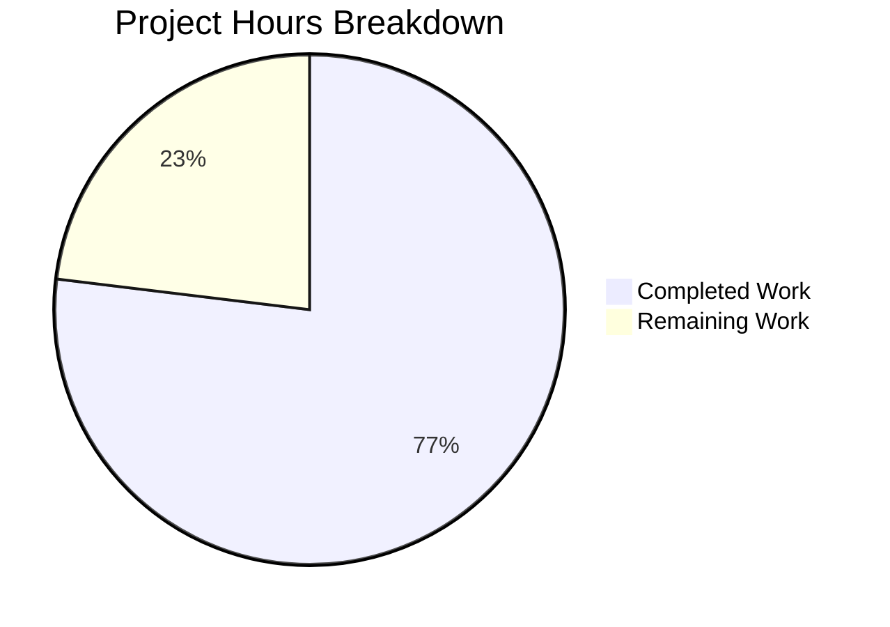

# Project Guide — Express.js Migration and New Endpoint

## 1. Executive Summary

**Completion: 10 hours completed out of 13 total hours = 77% complete.**

This project migrates a minimal Node.js HTTP server from the native `http` module to Express.js 5.2.1 and adds a new `GET /evening` endpoint returning `"Good evening"`. All five in-scope files specified in the Agent Action Plan have been successfully created or modified, with 100% validation success across dependencies, compilation, tests, and runtime.

### Key Achievements
- Complete Express.js migration with backward-compatible `GET /` endpoint
- New `GET /evening` endpoint fully implemented and tested
- 8/8 integration tests passing with zero failures
- Zero dependency vulnerabilities (npm audit clean)
- Zero compilation errors or warnings
- Runtime verified: both endpoints return correct responses
- Comprehensive documentation with endpoint table and setup instructions

### Critical Unresolved Issues
- **None** — All planned features are implemented and all validation checks pass

### Recommended Next Steps
- Human code review of the Express.js migration and test approach
- Manual verification of backward compatibility with any existing consumers
- Merge PR to main branch

---

## 2. Validation Results Summary

### 2.1 Final Validator Accomplishments
The Final Validator agent successfully validated all components and resolved one event-loop timing bug in the test suite.

### 2.2 Compilation Results

| File | Syntax Check | Result |
|------|-------------|--------|
| `server.js` | `node -c server.js` | ✅ Pass |
| `test/server.test.js` | `node -c test/server.test.js` | ✅ Pass |

**Result: 100% — Zero compilation errors or warnings**

### 2.3 Test Results

| Suite | Tests | Pass | Fail | Cancelled |
|-------|-------|------|------|-----------|
| GET / — Root endpoint | 3 | 3 | 0 | 0 |
| GET /evening — New endpoint | 3 | 3 | 0 | 0 |
| Undefined routes — 404 handling | 2 | 2 | 0 | 0 |
| **Total** | **8** | **8** | **0** | **0** |

**Result: 100% — 8/8 tests passing, verified reliable across multiple runs**

### 2.4 Runtime Verification

| Endpoint | Status | Response Body | Content-Type | Result |
|----------|--------|---------------|--------------|--------|
| `GET /` | 200 | `Hello, universe!\n` | text/plain; charset=utf-8 | ✅ Pass |
| `GET /evening` | 200 | `Good evening` | text/plain; charset=utf-8 | ✅ Pass |
| `GET /nonexistent` | 404 | HTML error page | text/html | ✅ Pass |

**Result: 100% — Server starts on 127.0.0.1:3000, all endpoints respond correctly**

### 2.5 Dependency Status

| Metric | Value |
|--------|-------|
| Production dependency | express@5.2.1 |
| Total packages installed | 66 |
| Vulnerabilities | 0 |
| Node.js version | v20.20.0 |
| npm version | 11.1.0 |

**Result: 100% — Clean dependency tree with no vulnerabilities**

### 2.6 Fixes Applied During Validation

| # | Issue | Root Cause | Fix Applied |
|---|-------|-----------|-------------|
| 1 | All 8 tests cancelled (not failing, cancelled) | `server.js` auto-started Express server on `require()`, causing event-loop timing conflict with Node.js v20 built-in test runner's `before()` hook Promise resolution | Added `require.main === module` guard in `server.js` so server only auto-starts when run directly; switched `test/server.test.js` `before()`/`after()` hooks from Promise-based to callback-based (`done`) pattern |

---

## 3. Visual Representation

### Hours Breakdown



**Calculation: 10 hours completed / (10 + 3) total hours = 77% complete**

### Completed Hours Breakdown (10h)

| Component | Hours | Details |
|-----------|-------|---------|
| Express.js research & version selection | 0.5 | Verified Express 5.2.1 compatibility with Node.js v20 |
| package.json modifications | 0.5 | Added dependency, start script, test script, corrected main field |
| npm install & lock file regeneration | 0.5 | Installed 66 packages, verified clean audit |
| server.js Express.js rewrite | 2.0 | Import replacement, app creation, 2 route handlers, startup guard, module exports (68 lines) |
| test/server.test.js creation | 3.5 | HTTP helpers, 4 describe blocks, 8 test cases, before/after hooks (227 lines) |
| README.md documentation update | 1.0 | Endpoint table, curl examples, setup instructions, dependency list (61 lines) |
| Event-loop timing bug debugging & fix | 1.5 | Diagnosed test cancellation root cause, implemented require.main guard and callback hooks |
| Validation cycles & runtime verification | 0.5 | Multiple test runs, manual endpoint testing, npm audit |
| **Total Completed** | **10** | |

### Remaining Hours Breakdown (3h)

| Task | Base Hours | After Multipliers (×1.15 ×1.25) |
|------|-----------|----------------------------------|
| Code review of Express.js migration | 1.0 | 1.4 |
| Manual backward compatibility verification | 0.5 | 0.7 |
| PR merge and post-merge smoke test | 0.5 | 0.9 |
| **Total Remaining** | **2.0** | **3.0** |

---

## 4. Detailed Task Table

All remaining tasks for human developers to complete before production readiness:

| # | Task | Description | Priority | Severity | Hours | Confidence |
|---|------|-------------|----------|----------|-------|------------|
| 1 | Code review of Express.js migration | Review `server.js` rewrite from `http.createServer()` to Express.js: verify route definitions, response format, `require.main === module` guard, and exported members. Review `test/server.test.js` for test coverage adequacy and lifecycle management. Review `package.json` for correct dependency version and script definitions. | High | Medium | 1.4 | High |
| 2 | Manual backward compatibility verification | Manually verify that any existing consumers or CI/CD pipelines that depend on the `GET /` endpoint returning `"Hello, universe!\n"` on `127.0.0.1:3000` continue to work with the Express.js server. Test with actual consumer clients if available. | Medium | Medium | 0.7 | High |
| 3 | PR merge and post-merge smoke test | Merge the PR to main branch. Run `npm install && npm test && npm start` on the main branch to verify the merge was clean. Confirm server starts and both endpoints respond correctly in the target environment. | Medium | Low | 0.9 | High |
| | **Total Remaining Hours** | | | | **3.0** | |

**Verification: Task hours sum (1.4 + 0.7 + 0.9) = 3.0h = Remaining Work in pie chart ✓**

---

## 5. Development Guide

### 5.1 System Prerequisites

| Requirement | Minimum | Verified Version |
|-------------|---------|-----------------|
| Node.js | v18.0.0+ | v20.20.0 |
| npm | v8.0.0+ | 11.1.0 |
| Operating System | Linux, macOS, or Windows | Linux (verified) |

### 5.2 Environment Setup

Clone the repository and switch to the feature branch:

```bash
git clone <repository-url>
cd <repository-name>
git checkout blitzy-bc6bf605-83d9-4cc4-8ef2-e10e64eac46e
```

No environment variables are required. The server uses hardcoded `127.0.0.1:3000` as specified in the project scope.

### 5.3 Dependency Installation

Install all project dependencies from the project root:

```bash
npm install
```

**Expected output:**
```
added 66 packages, and audited 67 packages in Xs
found 0 vulnerabilities
```

Verify Express.js is installed:

```bash
npm ls express
```

**Expected output:**
```
hello_world@1.0.0
└── express@5.2.1
```

### 5.4 Running Tests

Execute the full test suite using the Node.js built-in test runner:

```bash
npm test
```

**Expected output:**
```
TAP version 13
# Subtest: Express.js Server - Endpoint Integration Tests
    ...
# tests 8
# suites 4
# pass 8
# fail 0
# cancelled 0
# skipped 0
```

All 8 tests should pass with 0 failures and 0 cancellations.

### 5.5 Starting the Server

Start the server using npm:

```bash
npm start
```

Or run directly with Node.js:

```bash
node server.js
```

**Expected console output:**
```
Server running at http://127.0.0.1:3000/
```

### 5.6 Verification Steps

With the server running, verify each endpoint in a separate terminal:

**Test the root endpoint:**

```bash
curl http://127.0.0.1:3000/
```

**Expected response:** `Hello, universe!`

**Test the evening endpoint:**

```bash
curl http://127.0.0.1:3000/evening
```

**Expected response:** `Good evening`

**Test 404 handling:**

```bash
curl -s -o /dev/null -w "%{http_code}" http://127.0.0.1:3000/nonexistent
```

**Expected response:** `404`

### 5.7 Troubleshooting

| Issue | Cause | Resolution |
|-------|-------|------------|
| `Error: Cannot find module 'express'` | Dependencies not installed | Run `npm install` from project root |
| `EADDRINUSE: address already in use :::3000` | Port 3000 already occupied | Kill the existing process: `lsof -ti:3000 \| xargs kill` |
| Tests show `cancelled` instead of `pass` | Stale server.js without `require.main` guard | Ensure `server.js` has the `if (require.main === module)` guard around `app.listen()` |

---

## 6. Risk Assessment

| # | Risk | Category | Severity | Likelihood | Mitigation |
|---|------|----------|----------|------------|------------|
| 1 | Express 5.x is a relatively recent major release; minor ecosystem incompatibilities may surface | Technical | Low | Low | Pin to `^5.2.1` in package.json; lock file ensures deterministic installs; no middleware beyond core Express is used |
| 2 | Server binds to `127.0.0.1` (loopback only) — not accessible from external networks | Operational | Low | N/A | By design per scope requirements; change to `0.0.0.0` if external access is needed in future |
| 3 | No HTTPS/TLS encryption on server | Security | Low | Low | Out of scope per Agent Action Plan §0.6.2; add TLS termination via reverse proxy if deploying to production |
| 4 | No request logging, monitoring, or health check endpoints | Operational | Low | Low | Out of scope per Agent Action Plan §0.6.2; add middleware (morgan, express-status-monitor) if production observability is needed |
| 5 | No rate limiting or input validation middleware | Security | Low | Low | Out of scope; endpoints return static strings with no user input processing, minimizing attack surface |
| 6 | `package.json` main field previously pointed to non-existent `index.js` | Technical | Low | N/A | Fixed in this PR — `main` now correctly points to `server.js` |

**Overall Risk Assessment: LOW** — The project is a minimal test fixture with static responses, no user input processing, no database, and no external integrations. The attack surface is negligible.

---

## 7. Git Repository Analysis

### 7.1 Commit History (8 commits)

| # | Hash | Author | Message |
|---|------|--------|---------|
| 1 | b865638 | Sandeep01Kumar | Update server.js |
| 2 | 3ad1fb9 | Blitzy Agent | Add express@^5.2.1 as production dependency |
| 3 | 63f94ee | Blitzy Agent | Update package.json: add Express.js dependency, start script, and correct main entry point |
| 4 | ea61beb | Blitzy Agent | Migrate server.js from native http module to Express.js framework |
| 5 | 6f15a64 | Blitzy Agent | Validate Express.js migration: update server.js with server export, create test/server.test.js, update README.md |
| 6 | 15e470d | Blitzy Agent | Update README.md to document Express.js migration and new endpoints |
| 7 | d3420b8 | Blitzy Agent | Create integration tests for Express.js server endpoints |
| 8 | e0e8fbc | Blitzy Agent | Fix server.js and test/server.test.js for reliable test execution |

### 7.2 File Change Summary

| File | Lines Added | Lines Removed | Net Change |
|------|-------------|---------------|------------|
| server.js | 60 | 7 | +53 |
| package.json | 7 | 3 | +4 |
| package-lock.json | 814 | 0 | +814 |
| test/server.test.js | 226 | 0 | +226 (new file) |
| README.md | 59 | 1 | +58 |
| **Total** | **1,166** | **11** | **+1,155** |

### 7.3 Feature Completion Matrix

| # | Requirement (from Agent Action Plan) | File | Status |
|---|--------------------------------------|------|--------|
| 1 | Replace `http.createServer()` with Express.js app | server.js | ✅ Complete |
| 2 | `GET /` returns `"Hello, universe!\n"` with status 200, text/plain | server.js | ✅ Complete & Verified |
| 3 | `GET /evening` returns `"Good evening"` with status 200, text/plain | server.js | ✅ Complete & Verified |
| 4 | Server binds to 127.0.0.1:3000 | server.js | ✅ Complete & Verified |
| 5 | Startup message: `Server running at http://127.0.0.1:3000/` | server.js | ✅ Complete & Verified |
| 6 | Add `express@^5.2.1` to dependencies | package.json | ✅ Complete |
| 7 | Add `start` script (`node server.js`) | package.json | ✅ Complete |
| 8 | Correct `main` field to `server.js` | package.json | ✅ Complete |
| 9 | Regenerate package-lock.json via npm install | package-lock.json | ✅ Complete |
| 10 | Integration tests for both endpoints and 404 handling | test/server.test.js | ✅ Complete (8/8 pass) |
| 11 | Update documentation with endpoints, setup instructions | README.md | ✅ Complete |
| 12 | Maintain CommonJS `require()` syntax | All files | ✅ Complete |
| 13 | Preserve behavioral parity (§0.4.3) | server.js | ✅ Complete & Verified |

**All 13 requirements from the Agent Action Plan are fully implemented and verified.**
