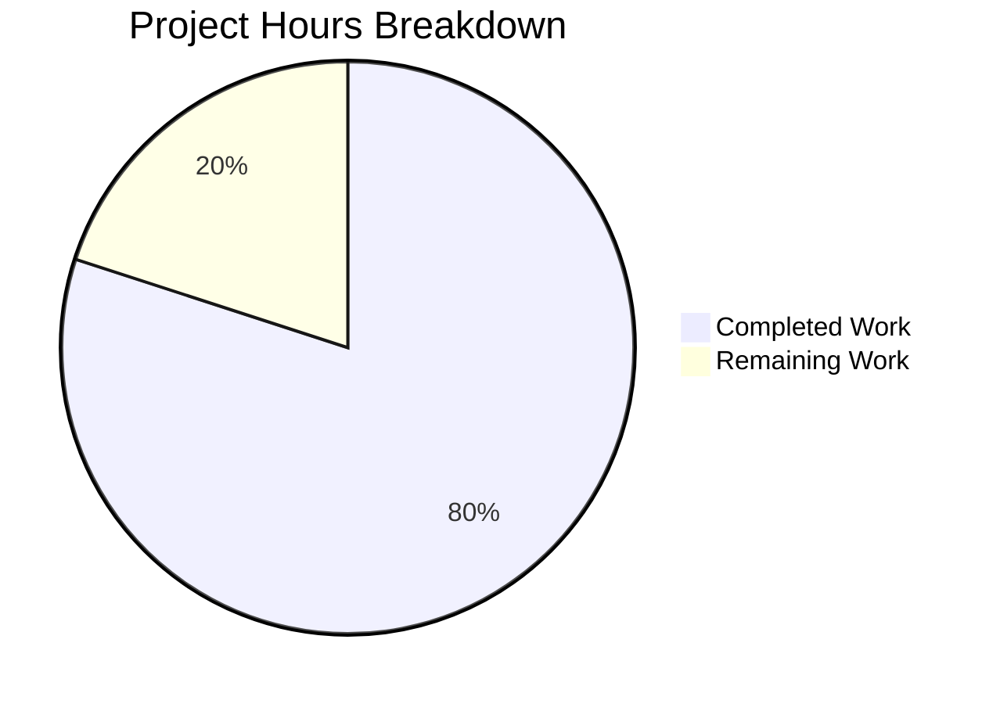

# Project Guide: Express.js Migration & Evening Endpoint Addition

## 1. Executive Summary

**Project Completion: 80% (4 hours completed out of 5 total hours)**

This project migrates a minimal Node.js tutorial HTTP server from the built-in `http` module to the Express.js framework (v5.2.1) and adds a new `GET /evening` endpoint. All 4 in-scope files (`server.js`, `package.json`, `package-lock.json`, `README.md`) have been successfully modified per the Agent Action Plan. Every validation gate—dependency installation, syntax checking, and runtime endpoint verification—passed without issues. No fixes were required during validation.

**Completion Calculation:**
- Completed: 4 hours (1h server.js rewrite + 0.5h package.json update + 0.5h dependency lock + 1h README documentation + 1h validation/testing)
- Remaining: 1 hour (0.5h .gitignore creation + 0.5h human review and merge)
- Total: 5 hours
- Completion: 4 / 5 = **80%**

**Key Achievements:**
- Express.js 5.2.1 integrated as sole production dependency (65 transitive packages, 0 vulnerabilities)
- `GET /` endpoint preserved with exact original response (`Hello, World!\n`, text/plain, 200)
- `GET /evening` endpoint added returning `Good evening` (text/plain, 200)
- Server binding to `127.0.0.1:3000` and startup log preserved
- CommonJS module system maintained throughout
- Comprehensive tutorial README with endpoint reference table

**Recommended Next Steps:**
1. Add a `.gitignore` file to exclude `node_modules/` from version control
2. Review code and merge PR

---

## 2. Validation Results Summary

### 2.1 Final Validator Findings

The Final Validator confirmed all implementation work was correctly completed by prior agents. **No issues were found and no fixes were required.**

### 2.2 Gate Results

| Gate | Status | Details |
|------|--------|---------|
| **Dependencies** | ✅ PASSED | `npm install` — 66 packages audited, 0 vulnerabilities |
| **Compilation/Syntax** | ✅ PASSED | `node --check server.js` — zero syntax errors |
| **Tests** | ✅ PASSED (N/A) | No test infrastructure; explicitly out of scope per Agent Action Plan §0.6.2 |
| **Runtime** | ✅ PASSED | All 3 endpoint behaviors verified (see below) |

### 2.3 Runtime Verification Results

| Endpoint | Expected | Actual | Status |
|----------|----------|--------|--------|
| `GET /` | 200, text/plain, `Hello, World!\n` | 200, text/plain; charset=utf-8, `Hello, World!\n` | ✅ |
| `GET /evening` | 200, text/plain, `Good evening` | 200, text/plain; charset=utf-8, `Good evening` | ✅ |
| `GET /nonexistent` | 404 Not Found | 404 Not Found (Express default) | ✅ |

### 2.4 Dependency Security Audit

```
npm audit: found 0 vulnerabilities
```

### 2.5 Git Status

- 4 commits on feature branch by Blitzy Agent
- All in-scope file changes committed
- Only untracked item: `node_modules/` (correctly excluded from version control)
- Branch is up to date with remote

---

## 3. Hours Breakdown & Visual Representation

### 3.1 Completed Work Breakdown (4 hours)

| Component | Hours | Details |
|-----------|-------|---------|
| server.js rewrite | 1.0h | Replaced `http.createServer()` with Express.js, defined 2 route handlers, preserved config |
| package.json update | 0.5h | Added dependency, updated main/description/scripts fields |
| package-lock.json + deps | 0.5h | Dependency installation and lock file regeneration (65 packages) |
| README.md documentation | 1.0h | Complete 58-line tutorial documentation with endpoint table and setup instructions |
| Validation & testing | 1.0h | Syntax checking, runtime endpoint verification, security audit |
| **Total Completed** | **4.0h** | |

### 3.2 Remaining Work Breakdown (1 hour)

| Task | Hours | Details |
|------|-------|---------|
| Add .gitignore file | 0.5h | Create `.gitignore` to exclude `node_modules/` per §0.7.1 recommendation |
| Human review & merge | 0.5h | Code review, PR approval, and branch merge |
| **Total Remaining** | **1.0h** | |

### 3.3 Pie Chart



---

## 4. Detailed Task Table for Human Developers

All remaining tasks are listed below. The sum of task hours (1.0h) equals the "Remaining Work" in the pie chart.

| # | Task | Priority | Severity | Hours | Action Steps |
|---|------|----------|----------|-------|-------------|
| 1 | Add `.gitignore` to exclude `node_modules/` | Medium | Low | 0.5h | Create a `.gitignore` file at the repository root containing `node_modules/` on its own line. This prevents the 65-package dependency directory from being accidentally committed. Recommended in Agent Action Plan §0.7.1. |
| 2 | Code review and PR merge | Medium | Low | 0.5h | Review all 4 modified files for correctness. Verify endpoints by running `npm install && node server.js` and testing with `curl`. Approve and merge the PR. |
| | **Total Remaining Hours** | | | **1.0h** | |

---

## 5. Comprehensive Development Guide

### 5.1 System Prerequisites

| Requirement | Version | Verification Command |
|-------------|---------|---------------------|
| Node.js | v20.x or higher | `node -v` |
| npm | v9.x or higher | `npm -v` |
| OS | Linux, macOS, or Windows | Any modern OS |
| curl (for testing) | Any version | `curl --version` |

The development environment used for validation: Node.js v20.20.0, npm v11.1.0.

### 5.2 Environment Setup

No virtual environment, `.env` file, or environment variable configuration is required. The server uses hardcoded constants for host (`127.0.0.1`) and port (`3000`). There are no external services, databases, or caches to configure.

### 5.3 Dependency Installation

From the repository root directory:

```bash
npm install
```

**Expected output:**
```
added 65 packages, and audited 66 packages in 3s
22 packages are looking for funding
  run `npm fund` for details
found 0 vulnerabilities
```

This installs Express.js 5.2.1 and its 64 transitive dependencies into `node_modules/`.

### 5.4 Syntax Verification

Verify the server file has no syntax errors:

```bash
node --check server.js
```

**Expected output:** No output (silent success, exit code 0).

### 5.5 Application Startup

Start the server using either command:

```bash
npm start
```

or directly:

```bash
node server.js
```

**Expected output:**
```
Server running at http://127.0.0.1:3000/
```

The server binds to `127.0.0.1` on port `3000`. Press `Ctrl+C` to stop.

### 5.6 Endpoint Verification

With the server running, open a separate terminal and test the endpoints:

**Test the Hello World endpoint:**
```bash
curl http://127.0.0.1:3000/
```
Expected response: `Hello, World!`

**Test the Good Evening endpoint:**
```bash
curl http://127.0.0.1:3000/evening
```
Expected response: `Good evening`

**Test 404 handling for unknown routes:**
```bash
curl -i http://127.0.0.1:3000/nonexistent
```
Expected: HTTP 404 Not Found response.

### 5.7 Troubleshooting

| Issue | Cause | Resolution |
|-------|-------|------------|
| `Error: Cannot find module 'express'` | Dependencies not installed | Run `npm install` |
| `EADDRINUSE: address already in use` | Port 3000 occupied | Stop the other process using port 3000 or change the `port` constant in `server.js` |
| `npm ERR! engine` | Node.js version too old | Upgrade to Node.js v20+ (Express 5.x requires Node.js ≥ 18) |

---

## 6. Risk Assessment

### 6.1 Technical Risks

| Risk | Severity | Likelihood | Mitigation |
|------|----------|------------|------------|
| Missing `.gitignore` may cause `node_modules/` to be committed | Low | Medium | Create `.gitignore` with `node_modules/` entry (Task #1) |
| No test infrastructure to catch regressions | Low | Low | Project scope explicitly excludes tests (§0.6.2); acceptable for a tutorial |
| Hardcoded host/port prevents flexible deployment | Low | Low | Acceptable for tutorial; for production, extract to environment variables |

### 6.2 Security Risks

| Risk | Severity | Likelihood | Mitigation |
|------|----------|------------|------------|
| `X-Powered-By: Express` header exposes framework | Low | Low | For production, add `app.disable('powered by')` or use `helmet` middleware |
| No rate limiting on endpoints | Low | Low | Tutorial scope; add `express-rate-limit` for production use |
| 0 known vulnerabilities in dependency tree | None | N/A | `npm audit` confirms clean dependency tree |

### 6.3 Operational Risks

| Risk | Severity | Likelihood | Mitigation |
|------|----------|------------|------------|
| No process manager for crash recovery | Low | Low | Tutorial scope; use PM2 or systemd for production deployment |
| No health check endpoint | Low | Low | Tutorial scope; add `/health` endpoint for production monitoring |
| No structured logging | Low | Low | Tutorial scope; integrate `morgan` or `pino` for production logging |

### 6.4 Integration Risks

| Risk | Severity | Likelihood | Mitigation |
|------|----------|------------|------------|
| No integration risks identified | N/A | N/A | Project has no external service dependencies, databases, or APIs to integrate with |

---

## 7. Implementation Details

### 7.1 Files Modified (4 of 4 planned)

| File | Change Type | Lines Before → After | Description |
|------|-------------|---------------------|-------------|
| `server.js` | Rewrite | 14 → 19 | Replaced `http.createServer()` with Express.js `app`, added `GET /` and `GET /evening` route handlers |
| `package.json` | Update | 11 → 14 | Added `express@^5.2.1` dependency, fixed `main` to `server.js`, added `start` script, updated `description` |
| `package-lock.json` | Regenerated | 13 → 827 | Full Express.js dependency tree with 65 packages (lockfileVersion 3) |
| `README.md` | Rewrite | 2 → 58 | Complete tutorial documentation with prerequisites, setup, endpoint table, project structure |

### 7.2 Git Commit History (4 commits)

| Commit | Description |
|--------|-------------|
| `7df8757` | Add express@^5.2.1 as production dependency and regenerate lock file |
| `6779e01` | Update package.json: add Express.js dependency, fix main entry point, add start script, update description |
| `da92e26` | Migrate server.js from http module to Express.js with two route handlers |
| `fb1fc5a` | Update README.md with Express.js tutorial documentation, endpoint reference, and setup instructions |

### 7.3 Code Volume

- **Lines added:** 890
- **Lines removed:** 11
- **Net change:** +879 lines (predominantly `package-lock.json` auto-generated content)
- **Source code change:** ~30 net lines (excluding lock file)

---

## 8. Feature Completion Matrix

| Requirement (from Agent Action Plan) | Status | Evidence |
|--------------------------------------|--------|----------|
| Integrate Express.js as a dependency | ✅ Complete | `express@5.2.1` in `package.json` and `node_modules/` |
| Preserve `GET /` returning `Hello, World!\n` | ✅ Complete | Runtime verified: 200 OK, text/plain |
| Add `GET /evening` returning `Good evening` | ✅ Complete | Runtime verified: 200 OK, text/plain |
| Preserve `127.0.0.1:3000` binding | ✅ Complete | Runtime verified: server starts on correct host/port |
| Preserve startup console log | ✅ Complete | Runtime verified: `Server running at http://127.0.0.1:3000/` |
| Maintain CommonJS module system | ✅ Complete | `require('express')` syntax used |
| Fix `main` field to `server.js` | ✅ Complete | `package.json` updated |
| Add `start` script | ✅ Complete | `"start": "node server.js"` added |
| Update `description` | ✅ Complete | Updated to reflect Express.js and dual endpoints |
| Regenerate `package-lock.json` | ✅ Complete | lockfileVersion 3, 65 packages |
| Rewrite `README.md` with tutorial docs | ✅ Complete | 58-line documentation with endpoint table |
| Express default 404 for unmatched routes | ✅ Complete | Runtime verified: 404 for unknown paths |
| Add `.gitignore` for `node_modules/` | ⚠️ Recommended | Mentioned in §0.7.1 but not in §0.5.1 file list; not yet created |

---

## 9. Cross-Report Consistency Verification

- [x] Completion % calculated using hours formula: 4 / (4 + 1) = 80%
- [x] Executive Summary states: "80% (4 hours completed out of 5 total hours)"
- [x] Pie chart uses exact hours: Completed Work = 4, Remaining Work = 1
- [x] Task table sums to exactly 1.0 hours (0.5h + 0.5h = 1.0h) matching pie chart remaining
- [x] All percentage and hour references are consistent throughout report
- [x] No conflicting or ambiguous statements exist