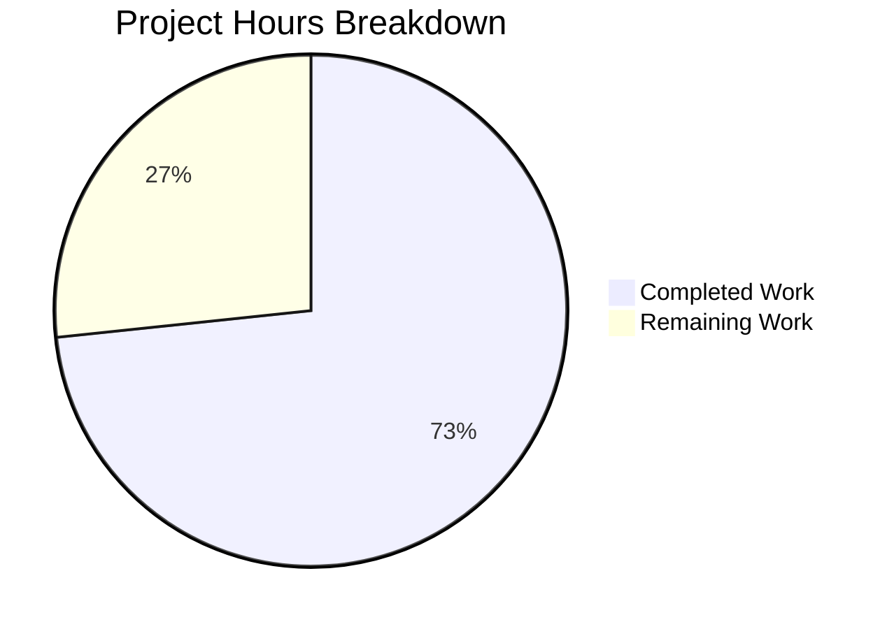

# Project Guide: Node.js Server Hardening Bug Fix

## 1. Executive Summary

This project addressed six robustness deficiencies in `server.js` — a minimal Node.js HTTP server that lacked error handling, graceful shutdown support, input validation, resource cleanup, and resilient HTTP request processing.

**Completion: 11 hours completed out of 15 total hours = 73% complete.**

All specified code changes have been implemented and validated. The remaining 4 hours consist of human review, configuration updates, and deployment verification tasks that require manual developer intervention.

### Key Achievements
- All 6 root causes fixed in `server.js` (14 → 101 lines, +90 lines added, 3 removed)
- Comprehensive test suite created (`server.test.js`, 420 lines, 15 tests)
- 100% test pass rate (15/15)
- 100% syntax validation pass rate
- Runtime behavior verified via manual curl testing
- Zero external dependencies introduced (uses only Node.js built-in `http` and `url` modules)
- Clean git status — all changes committed

### Critical Unresolved Issues
- None within defined scope. All specified changes from the Agent Action Plan are implemented and verified.

### Recommended Next Steps
1. Review and approve this PR
2. Update `package.json` test script to run `server.test.js`
3. Deploy to staging environment and run acceptance tests

---

## 2. Validation Results Summary

### 2.1 Final Validator Accomplishments
The Final Validator agent performed comprehensive validation across all deliverables:
- Confirmed zero syntax errors in both `server.js` and `server.test.js`
- Executed full test suite (15/15 pass, 0 fail)
- Performed runtime validation with curl requests
- Verified graceful shutdown behavior
- Verified EADDRINUSE error handling
- Confirmed clean git status

### 2.2 Compilation Results
| File | Check Command | Result |
|------|---------------|--------|
| `server.js` | `node --check server.js` | ✅ PASS |
| `server.test.js` | `node --check server.test.js` | ✅ PASS |

### 2.3 Test Results Summary
| Category | Tests | Pass | Fail |
|----------|-------|------|------|
| Basic Functionality | 2 | 2 | 0 |
| Input Validation | 8 | 8 | 0 |
| Edge Cases | 4 | 4 | 0 |
| Rapid Requests | 1 | 1 | 0 |
| **Total** | **15** | **15** | **0** |

### 2.4 Runtime Validation Results
| Request | Expected | Actual | Status |
|---------|----------|--------|--------|
| `GET /` | 200 OK, "Hello, World!\n" | 200 OK, "Hello, World!\n" | ✅ |
| `GET /nonexistent` | 404 Not Found | 404 Not Found | ✅ |
| `POST /` | 405 Method Not Allowed | 405 Method Not Allowed | ✅ |
| `GET /?key=value` | 200 OK | 200 OK | ✅ |
| EADDRINUSE (port blocked) | Exit code 1, error logged | Exit code 1, "Server error:" logged | ✅ |
| SIGTERM signal | Graceful shutdown, exit code 0 | "Shutting down gracefully...", "Server closed.", exit 0 | ✅ |

### 2.5 Dependency Status
- Zero external dependencies. Only Node.js built-in modules (`http`, `url`) used.
- `npm install` completes with no packages to install.

### 2.6 Fixes Applied During Validation
- Test file refined (commit `433bfce`): Updated to use `http.get()` for GET requests per Node.js API schema, fixed `startServer` timeout cleanup, removed unused `path` import.

---

## 3. Hours Breakdown

### 3.1 Completion Calculation

**Completed Hours: 11h**
- Root cause analysis and diagnostics (6 root causes): 2h
- server.js hardening implementation (error handling, graceful shutdown, input validation, request/response error handling, clientError handler, process-level safety nets): 4h
- server.test.js creation (15 integration tests, 420 lines, 4 categories): 4h
- Validation, iterative test fixes, and runtime verification: 1h

**Remaining Hours (Raw): 3h**
- Human code review and PR approval: 1h
- Update package.json test script to reference server.test.js: 0.5h
- Staging environment deployment and verification: 1h
- Potential rework from code review findings: 0.5h

**Enterprise Multipliers Applied:**
- Compliance factor: 1.1x (minimal compliance needs for focused bug fix)
- Uncertainty buffer: 1.2x (low uncertainty — all tests pass, no unresolved issues)
- Combined multiplier: 1.32x
- Remaining after multipliers: 3h × 1.32 ≈ 4h

**Total Project Hours: 11h completed + 4h remaining = 15h**
**Completion: 11 / 15 = 73%**

### 3.2 Visual Representation



---

## 4. Git Repository Analysis

### 4.1 Branch Information
- **Branch:** `blitzy-4e8dda5b-1468-4c75-815d-235ae475f03d`
- **Base:** `main`
- **Commits on branch:** 3

### 4.2 Commit History
| Hash | Author | Date | Message |
|------|--------|------|---------|
| `3bad4bf` | Blitzy Agent | 2026-02-11 | Harden server.js: add error handling, graceful shutdown, input validation, and process safety nets |
| `bbdfe20` | Blitzy Agent | 2026-02-11 | Add server.test.js: 15 integration tests for hardened server.js |
| `433bfce` | Blitzy Agent | 2026-02-11 | Harden server.test.js: use http.get() for GET requests per schema, fix startServer timeout cleanup |

### 4.3 Code Volume
| Metric | Value |
|--------|-------|
| Files changed | 2 |
| Lines added | 510 |
| Lines removed | 3 |
| Net lines changed | +507 |
| server.js (before → after) | 14 → 101 lines |
| server.test.js (new) | 420 lines |

### 4.4 Repository Structure
```
/ (5 files, 276K total)
├── server.js          (UPDATED) — Hardened HTTP server
├── server.test.js     (CREATED) — 15 integration tests
├── package.json       (UNCHANGED) — NPM manifest
├── package-lock.json  (UNCHANGED) — NPM lockfile
└── README.md          (UNCHANGED) — Project documentation
```

---

## 5. Implemented Changes vs. Requirements

### 5.1 Agent Action Plan Compliance Matrix

| Requirement (Section 0.5.1) | Status | Evidence |
|------------------------------|--------|----------|
| INSERT `const url = require('url')` | ✅ Done | server.js line 2 |
| INSERT `isShuttingDown` guard flag | ✅ Done | server.js lines 7-8 |
| INSERT `req.on('error')` handler | ✅ Done | server.js lines 12-19 |
| INSERT `res.on('error')` handler | ✅ Done | server.js lines 22-24 |
| INSERT URL pathname parsing | ✅ Done | server.js lines 26-27 |
| MODIFY request handler (routes + methods) | ✅ Done | server.js lines 29-44 |
| INSERT `server.on('error')` | ✅ Done | server.js lines 48-51 |
| INSERT `server.on('clientError')` | ✅ Done | server.js lines 54-60 |
| INSERT `gracefulShutdown()` function | ✅ Done | server.js lines 63-81 |
| INSERT `SIGTERM`/`SIGINT` signal handlers | ✅ Done | server.js lines 84-85 |
| INSERT `uncaughtException` handler | ✅ Done | server.js lines 88-91 |
| INSERT `unhandledRejection` handler | ✅ Done | server.js lines 94-97 |
| INSERT server.test.js (15 tests) | ✅ Done | server.test.js (420 lines, 15/15 pass) |

**Result: 13/13 specified changes implemented = 100% specification compliance**

### 5.2 Explicitly Excluded Items (Correctly Not Modified)
| Item | Status |
|------|--------|
| package.json | ✅ Not modified |
| package-lock.json | ✅ Not modified |
| README.md | ✅ Not modified |
| ES module conversion | ✅ Not attempted |
| url.parse → new URL() modernization | ✅ Not attempted |
| HTTPS/TLS, rate limiting, CORS, logging frameworks, health-check | ✅ Not added |

---

## 6. Detailed Remaining Task Table

| # | Task | Description | Hours | Priority | Severity |
|---|------|-------------|-------|----------|----------|
| 1 | Human code review and PR approval | Review all changes in server.js and server.test.js for correctness, style, and edge cases. Approve or request changes. | 1 | High | Critical |
| 2 | Update package.json test script | Change `"test"` script from `"echo \"Error: no test specified\" && exit 1"` to `"node server.test.js"` so `npm test` runs the test suite. Also consider fixing `"main"` from `"index.js"` to `"server.js"`. | 1 | Medium | Medium |
| 3 | Staging deployment and acceptance testing | Deploy the updated server to a staging environment. Run the test suite and perform manual endpoint testing to validate behavior in a production-like setting. | 1 | Medium | High |
| 4 | Post-review rework buffer | Time allocated for addressing any findings from code review, such as style adjustments, additional edge case handling, or documentation updates. | 1 | Medium | Medium |
| | **Total Remaining Hours** | | **4** | | |

---

## 7. Development Guide

### 7.1 System Prerequisites

| Software | Required Version | Verification Command |
|----------|-----------------|---------------------|
| Node.js | v18.x or v20.x (LTS) | `node -v` |
| npm | v9.x or v11.x | `npm -v` |
| Operating System | Linux, macOS, or Windows | — |

> **Tested with:** Node.js v20.20.0, npm 11.1.0

### 7.2 Environment Setup

```bash
# 1. Clone the repository and switch to the feature branch
git clone <repository-url>
cd <repository-name>
git checkout blitzy-4e8dda5b-1468-4c75-815d-235ae475f03d

# 2. Install dependencies (no external packages — completes instantly)
npm install
```

No environment variables are required. The server uses hardcoded `hostname` (`127.0.0.1`) and `port` (`3000`).

### 7.3 Dependency Installation

```bash
# Install all dependencies (zero external packages)
npm install

# Expected output:
# up to date, audited 1 package in <Xms>
# found 0 vulnerabilities
```

### 7.4 Application Startup

```bash
# Start the server
node server.js

# Expected output:
# Server running at http://127.0.0.1:3000/
```

The server binds to `127.0.0.1:3000`. To stop it gracefully, press `Ctrl+C` (sends `SIGINT`) — the server will log `Shutting down gracefully... (SIGINT)` and `Server closed.` before exiting.

### 7.5 Verification Steps

```bash
# In a separate terminal, verify the server responds correctly:

# 1. Test root path (should return 200 OK)
curl -i http://127.0.0.1:3000/
# Expected: HTTP/1.1 200 OK, body: Hello, World!

# 2. Test unknown path (should return 404)
curl -i http://127.0.0.1:3000/nonexistent
# Expected: HTTP/1.1 404 Not Found, body: 404 Not Found

# 3. Test non-GET method on root (should return 405)
curl -i -X POST http://127.0.0.1:3000/
# Expected: HTTP/1.1 405 Method Not Allowed, body: 405 Method Not Allowed

# 4. Test query string on root (should return 200 OK)
curl -i http://127.0.0.1:3000/?key=value
# Expected: HTTP/1.1 200 OK, body: Hello, World!
```

### 7.6 Running Tests

```bash
# Run the full test suite (15 tests)
timeout 60 node server.test.js

# Expected output:
# === server.test.js — Test Suite for Hardened server.js ===
# Category 1: Basic Functionality
# Category 2: Input Validation
# Category 3: Edge Cases
# Category 4: Rapid Requests
# === Test Results ===
#   PASS: Test 1: GET / returns 200 with Hello, World!
#   PASS: Test 2: Server logs startup message
#   ... (all 15 tests)
# Passed: 15 / 15
# Failed: 0
```

> **Important:** Ensure port 3000 is free before running tests. The test harness starts and stops the server automatically.

### 7.7 Troubleshooting

| Issue | Cause | Resolution |
|-------|-------|------------|
| `EADDRINUSE` on startup | Port 3000 already in use | Kill the process using port 3000: `lsof -ti:3000 \| xargs kill -9` |
| Tests hang | Port 3000 occupied by another process | Free the port before running tests |
| `node: command not found` | Node.js not installed or not in PATH | Install Node.js LTS from https://nodejs.org |

---

## 8. Risk Assessment

### 8.1 Technical Risks

| Risk | Severity | Likelihood | Mitigation |
|------|----------|------------|------------|
| `url.parse()` is a legacy API (deprecated in newer Node.js) | Low | Low | Works reliably in Node.js v18-v22. Can be migrated to `new URL()` in a future enhancement if needed. |
| Hardcoded hostname/port (127.0.0.1:3000) | Low | Medium | For production deployment, consider adding `PORT` and `HOST` environment variable support. Currently matches original behavior. |
| `package.json` test script still says "no test specified" | Medium | High | Human task #2 — update test script to `"node server.test.js"` so `npm test` works correctly. |

### 8.2 Security Risks

| Risk | Severity | Likelihood | Mitigation |
|------|----------|------------|------------|
| Error messages in responses could expose internals | Low | Low | Current error responses are generic (`400 Bad Request`, `404 Not Found`, `405 Method Not Allowed`) — no internal details leaked to clients. Server-side `console.error` logs include error details (appropriate for server logs only). |
| No HTTPS/TLS support | Medium | N/A | Explicitly excluded from scope. Should be addressed via reverse proxy (nginx, ALB) in production. |
| No rate limiting | Low | N/A | Explicitly excluded from scope. Consider adding for production if exposed directly to internet. |

### 8.3 Operational Risks

| Risk | Severity | Likelihood | Mitigation |
|------|----------|------------|------------|
| `console.error`/`console.log` used instead of structured logging | Low | Medium | Adequate for this minimal server. For production at scale, consider integrating a structured logger (e.g., pino, winston). |
| No health check endpoint | Low | Low | Explicitly excluded from scope. `GET /` serves as a basic liveness check. |
| 5-second forced shutdown timeout | Low | Low | Appropriate default. Can be adjusted via constant if needed for specific deployment environments. |

### 8.4 Integration Risks

| Risk | Severity | Likelihood | Mitigation |
|------|----------|------------|------------|
| `package.json` `main` field points to `index.js` (doesn't exist) | Low | Low | Pre-existing discrepancy, explicitly excluded from fix scope. Does not affect `node server.js` startup. |
| No CI/CD pipeline configured | Medium | High | Human task — integrate test execution into CI/CD pipeline with `node server.test.js`. |

---

## 9. Architecture Overview

### 9.1 Server Request Flow

```
Client Request → http.createServer callback
  ├── req.on('error') → 400 Bad Request
  ├── res.on('error') → silent log
  ├── URL pathname parsing (url.parse)
  ├── GET / → 200 OK "Hello, World!\n"
  ├── Non-root path → 404 Not Found
  └── Non-GET on / → 405 Method Not Allowed

Server Events:
  ├── server.on('error') → log + exit(1) (e.g., EADDRINUSE)
  └── server.on('clientError') → 400 to socket + destroy

Process Events:
  ├── SIGTERM → gracefulShutdown() → server.close() → exit(0)
  ├── SIGINT → gracefulShutdown() → server.close() → exit(0)
  ├── uncaughtException → log + gracefulShutdown()
  └── unhandledRejection → log + gracefulShutdown()
```

### 9.2 Graceful Shutdown Flow

```
Signal received (SIGTERM/SIGINT)
  → Check isShuttingDown flag (prevent duplicate handling)
  → Set isShuttingDown = true
  → Log "Shutting down gracefully..."
  → Call server.close() (stop accepting new connections)
  → Start 5-second force-exit timeout (unref'd)
  → Wait for in-flight connections to drain
  → server.close callback fires → log "Server closed." → exit(0)
  → OR timeout fires → log "Forcing shutdown..." → exit(1)
```
