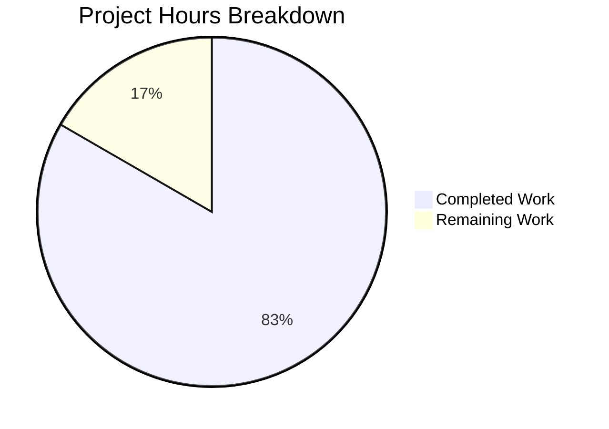

# Project Guide: Express.js Migration & Good Evening Endpoint

## 1. Executive Summary

**Project Completion: 83% (5 hours completed out of 6 total hours)**

This project migrates a minimal Node.js HTTP server from the built-in `http` module to the Express.js framework (v5.2.1) and adds a new `GET /evening` endpoint. All four repository files were modified as planned. The implementation is fully functional — dependency installation succeeds, syntax validation passes, and all endpoints return correct responses during runtime verification.

**Completion Calculation:**
- Completed: 5 hours (Express.js integration, server rewrite, package manifest updates, documentation, validation)
- Remaining: 1 hour (`.gitignore` creation, human code review and final QA)
- Total: 6 hours
- Completion: 5 / 6 = 83%

**Key Achievements:**
- Express.js v5.2.1 integrated as sole production dependency (65 transitive packages)
- `GET /` endpoint preserved with identical `Hello, World!\n` response
- `GET /evening` endpoint added returning `Good evening`
- Server binding (`127.0.0.1:3000`) and startup log message preserved
- CommonJS module system maintained throughout
- Comprehensive tutorial README.md written (83 lines)
- Zero vulnerabilities in dependency audit
- Zero compilation errors
- Zero runtime failures

**Critical Unresolved Issues:** None — all Agent Action Plan requirements are fulfilled.

**Recommended Next Steps:**
1. Add a `.gitignore` file to prevent `node_modules/` from being committed
2. Perform human code review and merge

---

## 2. Validation Results Summary

### 2.1 Final Validator Accomplishments

The Final Validator agent verified the complete implementation with zero issues found and zero fixes required. The implementation was correct on first pass.

### 2.2 Dependency Installation

| Metric | Result |
|--------|--------|
| `npm install` | ✅ Success |
| Total packages installed | 66 (1 direct + 65 transitive) |
| Vulnerabilities | 0 |
| Direct dependency | express@5.2.1 |
| Lock file version | 3 (npm 9+) |

### 2.3 Compilation / Syntax Validation

| File | Check | Result |
|------|-------|--------|
| `server.js` | `node -c server.js` | ✅ Passes — zero syntax errors |
| `package.json` | JSON validity | ✅ Valid JSON |

### 2.4 Runtime Verification

| Endpoint | Method | Expected Response | Actual Response | Status | Result |
|----------|--------|-------------------|-----------------|--------|--------|
| `/` | GET | `Hello, World!\n` | `Hello, World!\n` | 200 | ✅ Pass |
| `/evening` | GET | `Good evening` | `Good evening` | 200 | ✅ Pass |
| `/unknown` | GET | 404 (Express default) | 404 | 404 | ✅ Pass |

Server startup log confirmed: `Server running at http://127.0.0.1:3000/`

### 2.5 Test Results

No test framework or test files exist in this project. This is **explicitly out of scope** per the Agent Action Plan (Section 0.6.2): *"Testing infrastructure — No test framework, test files, or test scripts are being added."*

### 2.6 Fixes Applied During Validation

**None** — the implementation was correct as delivered. Zero issues were identified and zero fixes were applied by the Final Validator.

---

## 3. Hours Breakdown

### 3.1 Completed Work (5 hours)

| Component | Work Performed | Hours |
|-----------|---------------|-------|
| server.js rewrite | Replaced `http.createServer()` with Express.js app, defined two route handlers, preserved binding config | 1.5 |
| package.json updates | Added express dependency, corrected `main` field, added `start` script, updated description | 0.5 |
| package-lock.json regeneration | Ran `npm install`, verified 65-package dependency tree, confirmed lockfileVersion 3 | 0.5 |
| README.md documentation | Wrote 83 lines of comprehensive tutorial docs with endpoints, setup, usage, and project structure | 1.5 |
| Validation and verification | Syntax checking, runtime endpoint testing, dependency audit, AAP compliance verification | 1.0 |
| **Total Completed** | | **5.0** |

### 3.2 Remaining Work (1 hour)

| Task | Hours |
|------|-------|
| Add `.gitignore` file to exclude `node_modules/` | 0.5 |
| Human code review and final QA sign-off | 0.5 |
| **Total Remaining** | **1.0** |

### 3.3 Visual Representation



**Verification:** 5 completed / (5 + 1) total = 5/6 = 83% complete. Pie chart slices: 83% completed, 17% remaining.

---

## 4. Git Change Analysis

### 4.1 Branch Information

- **Feature branch:** `blitzy-76e71d5c-ce68-4592-9b18-295cde9ae87a`
- **Base branch:** `origin/mass1`
- **Total commits:** 4
- **All commits by:** Blitzy Agent (2026-02-11)

### 4.2 Commit History

| Hash | Message |
|------|---------|
| `beb9caf` | Setup: Add express@^5.2.1 as production dependency |
| `56a0dec` | Update package.json: add Express.js dependency, fix main entry point, add start script, update description |
| `a4bcc1e` | Migrate server.js from http module to Express.js framework |
| `3fd6d43` | docs: rewrite README.md with Express.js tutorial documentation |

### 4.3 File Change Summary

| File | Lines Added | Lines Removed | Net Change |
|------|------------|---------------|------------|
| `server.js` | 12 | 6 | +6 |
| `package.json` | 7 | 3 | +4 |
| `package-lock.json` | 814 | 0 | +814 |
| `README.md` | 83 | 2 | +81 |
| **Total** | **916** | **11** | **+905** |

---

## 5. Detailed Task Table (Remaining Work)

| # | Task | Description | Priority | Severity | Hours | Confidence |
|---|------|-------------|----------|----------|-------|------------|
| 1 | Add `.gitignore` file | Create a `.gitignore` at the repository root with `node_modules/` entry to prevent the dependency directory from being committed to version control. The Agent Action Plan (Section 0.7.1) notes this "should be considered." | Low | Low | 0.5 | High |
| 2 | Human code review and final QA | Review all 4 modified files for correctness, Express.js best practices, and tutorial clarity. Verify endpoint behavior matches specification. Approve and merge the pull request. | Medium | Low | 0.5 | High |
| | **Total Remaining Hours** | | | | **1.0** | |

**Verification:** Task table sums to 1.0 hours = "Remaining Work" in pie chart (1 hour) ✓

---

## 6. Development Guide

### 6.1 System Prerequisites

| Software | Minimum Version | Verified Version |
|----------|----------------|-----------------|
| Node.js | v18+ (Express 5.x requirement) | v20.20.0 |
| npm | v9+ (lockfileVersion 3) | v11.1.0 |
| Operating System | Linux, macOS, or Windows | Ubuntu (validated) |

### 6.2 Environment Setup

No environment variables, virtual environments, or external services are required. The server uses hardcoded configuration (`127.0.0.1:3000`) by design, as this is a tutorial project.

### 6.3 Dependency Installation

From the repository root directory, run:

```bash
npm install
```

**Expected output:**
```
added 66 packages, and audited 67 packages in Xs
found 0 vulnerabilities
```

**Verification:**
```bash
npm ls
```

Expected:
```
hello_world@1.0.0
└── express@5.2.1
```

### 6.4 Application Startup

Start the server using either command:

```bash
npm start
```

or equivalently:

```bash
node server.js
```

**Expected output:**
```
Server running at http://127.0.0.1:3000/
```

The server binds to `127.0.0.1` on port `3000`. Ensure port 3000 is not already in use.

### 6.5 Verification Steps

With the server running, open a second terminal and test all endpoints:

**Test GET / (Hello World endpoint):**
```bash
curl http://127.0.0.1:3000/
```
Expected response: `Hello, World!`

**Test GET /evening (Good Evening endpoint):**
```bash
curl http://127.0.0.1:3000/evening
```
Expected response: `Good evening`

**Test unknown path (404 behavior):**
```bash
curl -s -o /dev/null -w "%{http_code}" http://127.0.0.1:3000/unknown
```
Expected response: `404`

### 6.6 Stopping the Server

Press `Ctrl+C` in the terminal where the server is running.

### 6.7 Troubleshooting

| Issue | Cause | Resolution |
|-------|-------|------------|
| `Error: Cannot find module 'express'` | Dependencies not installed | Run `npm install` |
| `EADDRINUSE: address already in use :::3000` | Port 3000 occupied | Kill the process using port 3000: `lsof -ti:3000 \| xargs kill` |
| `node: command not found` | Node.js not installed | Install Node.js v20+ from https://nodejs.org |

---

## 7. Agent Action Plan Compliance

| Requirement | Status | Evidence |
|-------------|--------|----------|
| Integrate Express.js as dependency | ✅ Complete | `express@5.2.1` in package.json and node_modules |
| Preserve "Hello, World!" endpoint at GET / | ✅ Complete | Returns `Hello, World!\n` with HTTP 200 |
| Add "Good evening" endpoint at GET /evening | ✅ Complete | Returns `Good evening` with HTTP 200 |
| Maintain CommonJS module syntax | ✅ Complete | `const express = require('express')` in server.js |
| Preserve server binding (127.0.0.1:3000) | ✅ Complete | `app.listen(port, hostname, ...)` verified |
| Preserve startup console log | ✅ Complete | `Server running at http://127.0.0.1:3000/` confirmed |
| Fix package.json `main` field | ✅ Complete | Changed from `index.js` to `server.js` |
| Add npm start script | ✅ Complete | `"start": "node server.js"` in scripts |
| Regenerate package-lock.json | ✅ Complete | 827 lines, lockfileVersion 3, 65 packages |
| Update README.md | ✅ Complete | 83 lines of tutorial documentation |
| Keep flat file structure | ✅ Complete | 4 files at root, no subdirectories added |
| Express 5.x caret semver range | ✅ Complete | `"express": "^5.2.1"` |
| No node_modules in version control | ✅ Complete | Only untracked, not committed |

---

## 8. Risk Assessment

### 8.1 Technical Risks

| Risk | Severity | Likelihood | Mitigation |
|------|----------|-----------|------------|
| Missing `.gitignore` could lead to `node_modules/` being committed | Low | Medium | Create `.gitignore` with `node_modules/` entry (Task #1) |
| No test coverage for regression detection | Low | Low | Explicitly out of scope per AAP; add tests if project evolves beyond tutorial |

### 8.2 Security Risks

| Risk | Severity | Likelihood | Mitigation |
|------|----------|-----------|------------|
| No security middleware (helmet, CORS, rate limiting) | Low | Low | Appropriate for tutorial; add if project moves to production use |
| Express.js v5.2.1 has 0 known vulnerabilities | None | N/A | `npm audit` returns clean; continue monitoring |

### 8.3 Operational Risks

| Risk | Severity | Likelihood | Mitigation |
|------|----------|-----------|------------|
| Hardcoded host/port prevents environment-specific configuration | Low | Low | Explicitly out of scope per AAP; acceptable for tutorial project |
| No health check endpoint for monitoring | Low | Low | Explicitly out of scope; add if deploying to managed infrastructure |
| No process manager (pm2, systemd) for production uptime | Low | Low | Appropriate for tutorial; add for production deployment |

### 8.4 Integration Risks

| Risk | Severity | Likelihood | Mitigation |
|------|----------|-----------|------------|
| No integration risks identified | N/A | N/A | Project has no external service dependencies, databases, or third-party integrations |

**Overall Risk Level: LOW** — This is a self-contained tutorial project with minimal attack surface and no external dependencies beyond Express.js.

---

## 9. Repository Structure

```
.
├── server.js           # Express.js application (20 lines) — two route handlers
├── package.json        # npm manifest with express@^5.2.1 dependency
├── package-lock.json   # Dependency lock file (65 packages, lockfileVersion 3)
├── README.md           # Tutorial documentation (83 lines)
└── node_modules/       # Auto-generated dependencies (not committed)
```

**Total source files:** 4
**Total lines changed:** 916 added, 11 removed (+905 net)
**Language:** JavaScript (CommonJS)
**Runtime:** Node.js v20.20.0
