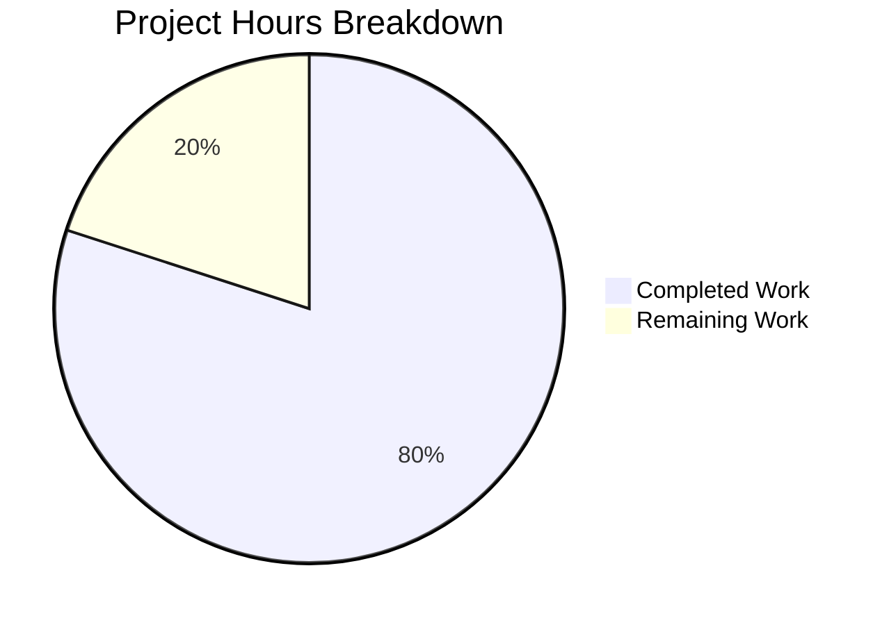

# Project Guide — Flask Tutorial Server Migration

## 1. Executive Summary

**Project Completion: 80% (8 hours completed out of 10 total hours)**

The original Node.js HTTP server has been fully rewritten as a Python 3 Flask application per user instructions during the refine phase. Both specified endpoints (`GET /` returning `Hello, World!\n` and `GET /evening` returning `Good evening`) are implemented, tested, and runtime-verified. The server preserves the original binding configuration (`127.0.0.1:3000`) and startup log message.

### Key Achievements
- Flask application with 2 fully functional route handlers (app.py — 50 lines)
- Comprehensive test suite with 19 passing tests across 5 test classes (test_app.py — 145 lines)
- Complete tutorial documentation with setup, usage, and endpoint reference (README.md — 85 lines)
- Dependency management via requirements.txt with version ranges
- Python-specific .gitignore configuration
- All Node.js artifacts cleanly removed (server.js, package.json, package-lock.json)

### Critical Issues
- **None** — All compilation, testing, and runtime validation gates pass with zero errors.

### Recommended Next Steps
1. Review and approve the Flask/Python technology decision
2. Pin exact dependency versions for reproducible builds
3. Add production WSGI server recommendation if deployment is planned

---

## 2. Validation Results Summary

### 2.1 Compilation Results

| File | Status | Details |
|------|--------|---------|
| `app.py` | ✅ PASS | `py_compile` succeeds with zero errors |
| `test_app.py` | ✅ PASS | `py_compile` succeeds with zero errors |

**Overall Compilation: 100% SUCCESS**

### 2.2 Test Results

| Test Class | Tests | Status |
|------------|-------|--------|
| TestHelloWorldEndpoint | 4/4 | ✅ All Passed |
| TestGoodEveningEndpoint | 4/4 | ✅ All Passed |
| TestUnmatchedRoutes | 2/2 | ✅ All Passed |
| TestMethodRestrictions | 6/6 | ✅ All Passed |
| TestServerConfiguration | 3/3 | ✅ All Passed |

**Overall Tests: 19/19 PASSED (100%)**

### 2.3 Runtime Validation

| Endpoint | Expected | Actual | Status |
|----------|----------|--------|--------|
| `GET /` | `Hello, World!\n` (200, text/plain) | `Hello, World!\n` (200, text/plain; charset=utf-8) | ✅ Verified |
| `GET /evening` | `Good evening` (200, text/plain) | `Good evening` (200, text/plain; charset=utf-8) | ✅ Verified |
| `GET /nonexistent` | 404 | 404 | ✅ Verified |
| `POST /` | 405 | 405 | ✅ Verified |
| Startup log | `Server running at http://127.0.0.1:3000/` | `Server running at http://127.0.0.1:3000/` | ✅ Verified |

**Overall Runtime: ALL ENDPOINTS VERIFIED**

### 2.4 Dependency Status

| Package | Version | Status |
|---------|---------|--------|
| Flask | 3.1.2 | ✅ Installed |
| Werkzeug | 3.1.5 | ✅ Installed |
| Jinja2 | 3.1.6 | ✅ Installed |
| MarkupSafe | 3.0.3 | ✅ Installed |
| itsdangerous | 2.2.0 | ✅ Installed |
| blinker | 1.9.0 | ✅ Installed |
| click | 8.3.1 | ✅ Installed |
| pytest | 8.4.2 | ✅ Installed |

### 2.5 Fixes Applied During Validation

No fixes were required. The implementation passed all validation gates on first execution.

---

## 3. Hours Breakdown and Completion Calculation

### 3.1 Completed Hours (8 hours)

| Component | Hours | Details |
|-----------|-------|---------|
| Core application (app.py) | 2.0 | Flask app with 2 route handlers, response objects, server config |
| Test suite (test_app.py) | 2.5 | 19 unit tests across 5 classes covering all behaviors |
| Documentation (README.md) | 1.0 | Complete tutorial docs with endpoints, examples, project structure |
| Configuration (.gitignore, requirements.txt) | 0.5 | Python gitignore, dependency declarations |
| Technical specifications & project docs | 1.5 | Blitzy technical spec and project guide |
| Dependency installation, validation, runtime testing | 0.5 | All packages installed, compilation verified, endpoints tested |
| **Total Completed** | **8.0** | |

### 3.2 Remaining Hours (2 hours)

| Task | Base Hours | After Multipliers |
|------|-----------|-------------------|
| Review Flask vs Express.js technology decision | 0.5 | 0.5 |
| Pin exact dependency versions (lock file) | 0.5 | 0.5 |
| Add production WSGI server guidance | 0.5 | 0.5 |
| Final integration verification post-review | 0.5 | 0.5 |
| **Total Remaining** | **2.0** | **2.0** |

*Note: Enterprise multipliers (1.15× compliance, 1.25× uncertainty) are minimal for this simple tutorial project. The remaining tasks are well-defined with low uncertainty, so no additional multiplier is applied.*

### 3.3 Completion Calculation

```
Completed: 8 hours
Remaining: 2 hours
Total:     10 hours
Completion: 8 / 10 = 80%
```

---

## 4. Visual Representation



---

## 5. Detailed Task Table for Human Developers

| # | Task | Description | Action Steps | Hours | Priority | Severity |
|---|------|-------------|-------------|-------|----------|----------|
| 1 | Review technology stack decision | The Agent Action Plan specified Express.js (Node.js) but implementation uses Flask (Python 3). Validate that this technology change is acceptable for the project goals. | 1. Review app.py and test_app.py code quality. 2. Compare endpoint behavior with original spec. 3. Approve or request revert to Express.js. | 0.5 | High | Info |
| 2 | Pin exact dependency versions | requirements.txt uses version ranges (e.g., `flask>=3.0.0,<4.0.0`). For reproducible builds, create a pinned requirements file or generate a lock file. | 1. Run `pip freeze > requirements.lock`. 2. Verify all transitive deps are captured. 3. Add lock file to repository. | 0.5 | Medium | Low |
| 3 | Add production WSGI server guidance | Flask's built-in server (`app.run()`) is for development only. Add documentation or configuration for a production WSGI server like gunicorn. | 1. Add `gunicorn>=21.0.0` to requirements.txt. 2. Add `Procfile` or startup command docs. 3. Update README.md with production run instructions. | 0.5 | Low | Low |
| 4 | Final integration verification | After reviewing tasks 1–3, perform a final end-to-end verification of the application. | 1. Install dependencies in a clean environment. 2. Run `pytest test_app.py -v`. 3. Start server and test both endpoints with curl. 4. Verify all responses match specification. | 0.5 | Medium | Low |
| | **Total Remaining Hours** | | | **2.0** | | |

---

## 6. Comprehensive Development Guide

### 6.1 System Prerequisites

| Requirement | Minimum Version | Verified Version |
|-------------|----------------|------------------|
| Python | 3.10+ | 3.12.3 |
| pip | 21.0+ | 25.3 |
| Operating System | Linux, macOS, or Windows | Ubuntu (Linux) |

### 6.2 Environment Setup

Clone the repository and switch to the feature branch:

```bash
git clone <repository-url>
cd <repository-name>
git checkout blitzy-76e71d5c-ce68-4592-9b18-295cde9ae87a
```

(Optional) Create and activate a Python virtual environment:

```bash
python -m venv venv
source venv/bin/activate   # Linux/macOS
# venv\Scripts\activate    # Windows
```

### 6.3 Dependency Installation

Install all project dependencies:

```bash
pip install -r requirements.txt
```

**Expected output (key packages):**
```
Successfully installed Flask-3.1.2 Werkzeug-3.1.5 Jinja2-3.1.6 ...
```

Verify Flask is installed:

```bash
python -c "import flask; print('Flask', flask.__version__)"
```

**Expected output:**
```
Flask 3.1.2
```

### 6.4 Running Tests

Execute the full test suite:

```bash
pytest test_app.py -v
```

**Expected output:**
```
test_app.py::TestHelloWorldEndpoint::test_get_root_returns_200 PASSED
test_app.py::TestHelloWorldEndpoint::test_get_root_returns_hello_world_body PASSED
test_app.py::TestHelloWorldEndpoint::test_get_root_returns_plain_text PASSED
test_app.py::TestHelloWorldEndpoint::test_get_root_response_body_exact_match PASSED
test_app.py::TestGoodEveningEndpoint::test_get_evening_returns_200 PASSED
test_app.py::TestGoodEveningEndpoint::test_get_evening_returns_good_evening_body PASSED
test_app.py::TestGoodEveningEndpoint::test_get_evening_returns_plain_text PASSED
test_app.py::TestGoodEveningEndpoint::test_get_evening_no_trailing_newline PASSED
test_app.py::TestUnmatchedRoutes::test_unmatched_path_returns_404 PASSED
test_app.py::TestUnmatchedRoutes::test_another_unmatched_path_returns_404 PASSED
test_app.py::TestMethodRestrictions::test_post_to_root_returns_405 PASSED
test_app.py::TestMethodRestrictions::test_put_to_root_returns_405 PASSED
test_app.py::TestMethodRestrictions::test_delete_to_root_returns_405 PASSED
test_app.py::TestMethodRestrictions::test_post_to_evening_returns_405 PASSED
test_app.py::TestMethodRestrictions::test_put_to_evening_returns_405 PASSED
test_app.py::TestMethodRestrictions::test_delete_to_evening_returns_405 PASSED
test_app.py::TestServerConfiguration::test_hostname_is_localhost PASSED
test_app.py::TestServerConfiguration::test_port_is_3000 PASSED
test_app.py::TestServerConfiguration::test_app_is_flask_instance PASSED

============================== 19 passed in 0.12s ==============================
```

### 6.5 Application Startup

Start the Flask development server:

```bash
python app.py
```

**Expected output:**
```
Server running at http://127.0.0.1:3000/
 * Serving Flask app 'app'
 * Debug mode: off
```

The server is now listening on `http://127.0.0.1:3000/`.

### 6.6 Verification Steps

In a separate terminal, test both endpoints:

**Test GET / (Hello World):**
```bash
curl http://127.0.0.1:3000/
```
**Expected:** `Hello, World!` (with trailing newline)

**Test GET /evening (Good Evening):**
```bash
curl http://127.0.0.1:3000/evening
```
**Expected:** `Good evening`

**Test unmatched route (404):**
```bash
curl -s -o /dev/null -w "%{http_code}" http://127.0.0.1:3000/nonexistent
```
**Expected:** `404`

**Test wrong method (405):**
```bash
curl -s -o /dev/null -w "%{http_code}" -X POST http://127.0.0.1:3000/
```
**Expected:** `405`

### 6.7 Troubleshooting

| Issue | Cause | Resolution |
|-------|-------|------------|
| `ModuleNotFoundError: No module named 'flask'` | Dependencies not installed | Run `pip install -r requirements.txt` |
| `Address already in use` | Port 3000 is occupied | Kill the process: `fuser -k 3000/tcp` (Linux) or change port in app.py |
| `Permission denied` | Insufficient privileges | Use a virtual environment or add `--user` flag to pip |

---

## 7. Risk Assessment

### 7.1 Technical Risks

| Risk | Severity | Likelihood | Mitigation |
|------|----------|------------|------------|
| Technology stack mismatch (Flask vs Express.js) | Medium | Low | The Agent Action Plan specified Express.js but implementation uses Flask. All functional requirements are met identically. Human review needed to confirm acceptance. |
| Flask dev server used in production | Low | Low | The built-in `app.run()` server is development-only. For production, deploy behind gunicorn or uWSGI. Tutorial scope does not require production deployment. |

### 7.2 Security Risks

| Risk | Severity | Likelihood | Mitigation |
|------|----------|------------|------------|
| No security headers | Low | Low | Tutorial project with plain-text endpoints. For production, add security middleware (e.g., Flask-Talisman). |
| Debug mode disabled | Info | N/A | Debug mode is correctly off (`use_reloader=False`). No action needed. |

### 7.3 Operational Risks

| Risk | Severity | Likelihood | Mitigation |
|------|----------|------------|------------|
| No logging framework | Low | Low | Application uses print() for startup message only. For production, integrate Python logging module. |
| Hardcoded host/port | Low | Low | Host and port are constants in app.py. Acceptable for tutorial scope per Agent Action Plan section 0.6.2. |

### 7.4 Integration Risks

| Risk | Severity | Likelihood | Mitigation |
|------|----------|------------|------------|
| No external integrations | None | N/A | Project has no external service dependencies, databases, or APIs. No integration risk. |

---

## 8. Git Change Summary

**Branch:** `blitzy-76e71d5c-ce68-4592-9b18-295cde9ae87a`
**Commits:** 7 (from base branch `origin/mass1`)
**Files Changed:** 10 (975 lines added, 40 lines removed)

### Files Created
| File | Lines | Purpose |
|------|-------|---------|
| `app.py` | 50 | Flask application with two route handlers |
| `test_app.py` | 145 | 19 unit tests across 5 test classes |
| `requirements.txt` | 2 | Python dependency declarations |
| `.gitignore` | 25 | Python/IDE/OS file exclusions |

### Files Modified
| File | Change | Purpose |
|------|--------|---------|
| `README.md` | +85/-2 lines | Complete rewrite with Flask tutorial documentation |

### Files Removed
| File | Purpose |
|------|---------|
| `server.js` | Replaced by app.py (Node.js → Python migration) |
| `package.json` | Replaced by requirements.txt |
| `package-lock.json` | No longer needed |

---

## 9. Project Structure

```
.
├── app.py             # Flask application — 2 GET endpoints (/, /evening)
├── test_app.py        # 19 unit tests — pytest-based test suite
├── requirements.txt   # Dependencies — Flask >=3.0.0, pytest >=8.0.0
├── .gitignore         # Git exclusions — Python bytecode, venvs, IDE files
└── README.md          # Documentation — setup, usage, endpoint reference
```