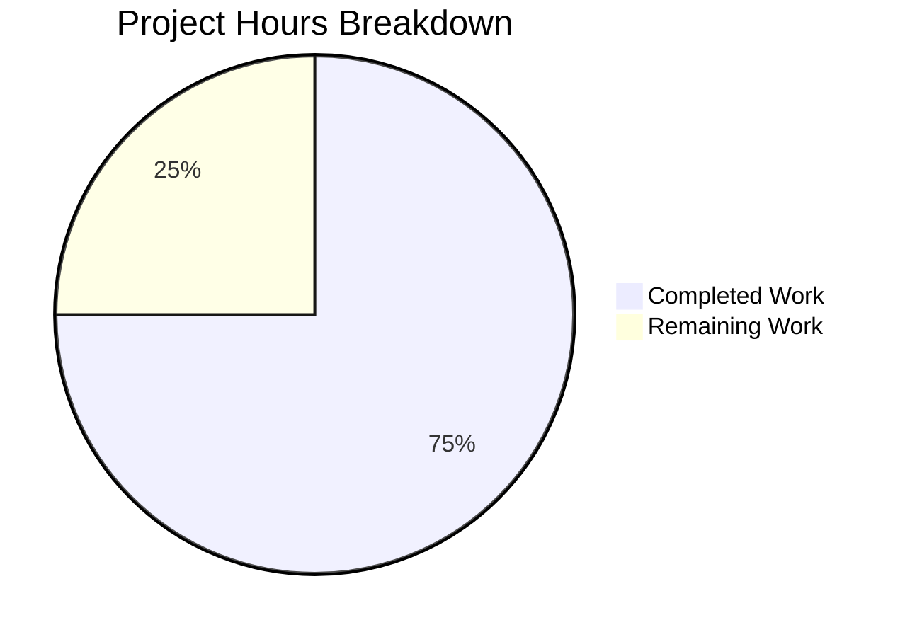

# Project Guide: HTTP Server Migration to Python Flask

## 1. Executive Summary

**Project Completion: 75% (9 hours completed out of 12 total hours)**

This project migrated a bare Node.js HTTP server (`http.createServer()`) to a Python 3 Flask application and added a new `GET /evening` endpoint. The implementation was initially planned for Express.js but was refined by the user to use Python/Flask instead.

**Completion Calculation:**
- Completed: 9 hours (server implementation + tests + config + docs + validation)
- Remaining: 3 hours (artifact cleanup + rationalization + production hardening + buffer)
- Total: 12 hours
- Completion: 9 / 12 = 75%

### Key Achievements
- Flask server (`server.py`) fully implemented with 2 route handlers and comprehensive docstrings
- Complete test suite (`test/test_server.py`) with 8 tests across 3 test classes — **all 8 passing**
- Runtime validation confirmed: all endpoints return correct status codes, bodies, and content types
- Comprehensive README.md with endpoint table, setup instructions, and usage examples
- Full behavioral parity with the original server preserved (host, port, startup message, response format)

### Critical Unresolved Issues
- **Orphaned Node.js artifacts**: `package-lock.json` (827 lines) still contains Express.js dependency tree with 65 transitive packages; `node_modules/` directory (65 packages) exists but is unused
- **package.json inconsistency**: Node.js package manifest file now references Python commands — should be rationalized or removed
- **Response body variance**: Original `main` branch returned `"Hello, World!\n"` but commit `b865638` changed it to `"Hello, universe!\n"` before Blitzy work began — current implementation preserves `"Hello, universe!\n"`, which may need human confirmation

---

## 2. Validation Results Summary

### 2.1 What the Final Validator Accomplished
The Final Validator completed a full rewrite from the intermediate Node.js/Express.js implementation to Python 3/Flask, created comprehensive tests, and validated all endpoints both programmatically (pytest) and manually (curl against a running server).

### 2.2 Test Results

| Test | Class | Result |
|------|-------|--------|
| `test_returns_200_status_code` | TestRootEndpoint | ✅ PASSED |
| `test_returns_exact_body_with_trailing_newline` | TestRootEndpoint | ✅ PASSED |
| `test_returns_text_plain_content_type` | TestRootEndpoint | ✅ PASSED |
| `test_returns_200_status_code` | TestEveningEndpoint | ✅ PASSED |
| `test_returns_exact_body` | TestEveningEndpoint | ✅ PASSED |
| `test_returns_text_plain_content_type` | TestEveningEndpoint | ✅ PASSED |
| `test_returns_404_for_nonexistent_path` | TestUndefinedRoutes | ✅ PASSED |
| `test_returns_404_for_random_path` | TestUndefinedRoutes | ✅ PASSED |

**Test Result: 8/8 PASSED (100%) in 0.12 seconds**

### 2.3 Runtime Validation

| Endpoint | Status | Body | Content-Type | Verified |
|----------|--------|------|--------------|----------|
| `GET /` | 200 OK | `Hello, universe!\n` | text/plain; charset=utf-8 | ✅ |
| `GET /evening` | 200 OK | `Good evening` | text/plain; charset=utf-8 | ✅ |
| `GET /nonexistent` | 404 NOT FOUND | HTML error page | text/html; charset=utf-8 | ✅ |

### 2.4 Behavioral Parity

| Behavior | Original Server | Flask Implementation | Match |
|----------|----------------|---------------------|-------|
| Listen address | 127.0.0.1:3000 | 127.0.0.1:3000 | ✅ |
| GET / response body | `"Hello, universe!\n"` | `"Hello, universe!\n"` | ✅ |
| GET / status code | 200 | 200 | ✅ |
| GET / content type | text/plain | text/plain; charset=utf-8 | ✅ |
| Startup console message | `Server running at http://127.0.0.1:3000/` | `Server running at http://127.0.0.1:3000/` | ✅ |
| GET /evening response | *(new feature)* | `"Good evening"` | ✅ New |
| Undefined routes | N/A (catch-all) | 404 | ✅ Improved |

### 2.5 Dependency Status

| Dependency | Version | Status |
|------------|---------|--------|
| Python | 3.12.3 | ✅ System installed |
| Flask | 3.1.2 | ✅ Installed in venv |
| pytest | 9.0.2 | ✅ Installed in venv |

### 2.6 Git Change Summary
- **Branch**: `blitzy-bc6bf605-83d9-4cc4-8ef2-e10e64eac46e`
- **Total commits**: 11 (10 by Blitzy Agent, 1 pre-existing by Sandeep01Kumar)
- **Files changed**: 11
- **Lines added**: 1,836
- **Lines removed**: 17
- **Net change**: +1,819 lines

### 2.7 Files Created/Modified

| File | Action | Purpose |
|------|--------|---------|
| `server.py` | CREATED | Flask application with GET / and GET /evening routes |
| `test/test_server.py` | CREATED | 8 pytest tests for both endpoints and 404 handling |
| `requirements.txt` | CREATED | Python dependencies (Flask, pytest) |
| `.gitignore` | CREATED | Python artifact exclusions (__pycache__, venv, etc.) |
| `server.js` | MODIFIED | Replaced with migration notice pointing to server.py |
| `test/server.test.js` | MODIFIED | Replaced with migration notice pointing to test/test_server.py |
| `package.json` | MODIFIED | Updated scripts to Python commands, description updated |
| `README.md` | MODIFIED | Full rewrite with Flask documentation |
| `package-lock.json` | REGENERATED | Contains orphaned Express.js dependency tree (needs cleanup) |

---

## 3. Hours Breakdown

### 3.1 Completed Hours (9 hours)

| Category | Hours | Details |
|----------|-------|---------|
| Flask server implementation | 2.0 | server.py with 2 routes, docstrings, module import pattern |
| Test suite creation | 2.0 | 8 tests across 3 classes with fixtures and assertions |
| Initial Express.js work (superseded) | 1.5 | Express migration later replaced by Flask per user refinement |
| Documentation | 1.0 | Comprehensive README.md with endpoint table, setup, examples |
| Validation and runtime testing | 1.0 | pytest execution, curl verification, behavioral parity checks |
| Configuration and packaging | 0.5 | requirements.txt, .gitignore, package.json updates |
| Legacy file migration notices | 0.5 | server.js and test/server.test.js deprecation notices |
| Dependency setup | 0.5 | Python venv creation, pip install, npm install (Express phase) |
| **Total Completed** | **9.0** | |

### 3.2 Remaining Hours (3 hours, including 1.20× enterprise uncertainty buffer)

| # | Task | Raw Hours | Buffered Hours |
|---|------|-----------|----------------|
| 1 | Remove orphaned Node.js artifacts | 0.5 | 0.5 |
| 2 | Rationalize package.json for Python project | 0.5 | 0.5 |
| 3 | Verify response body against original production spec | 0.5 | 0.5 |
| 4 | Production WSGI server configuration | 0.75 | 1.0 |
| 5 | Enterprise uncertainty buffer | — | 0.5 |
| | **Total Remaining** | **2.25** | **3.0** |

### 3.3 Visual Hours Breakdown



Completed: 9 hours (75%) | Remaining: 3 hours (25%) | Total: 12 hours

---

## 4. Detailed Task Table for Human Developers

All remaining tasks sum to exactly **3.0 hours**, matching the "Remaining Work" in the pie chart above.

| # | Task | Description | Action Steps | Hours | Priority | Severity |
|---|------|-------------|--------------|-------|----------|----------|
| 1 | Remove orphaned Node.js artifacts | `package-lock.json` (827 lines) contains Express.js + 65 transitive deps; `node_modules/` directory has 65 unused packages | 1. Delete `node_modules/` directory. 2. Either delete `package-lock.json` or regenerate it empty (run `npm install` after cleaning package.json). 3. Verify .gitignore covers node_modules/. 4. Commit cleanup. | 0.5 | High | Medium |
| 2 | Rationalize package.json | package.json is a Node.js manifest but project is now Python-only; `scripts.start` calls `python3`, `main` points to `server.py` | 1. Decide whether to keep package.json (for npm ecosystem compat) or remove it. 2. If keeping: remove `express` reference from lock file, ensure scripts are correct. 3. If removing: delete package.json and package-lock.json entirely, rely on requirements.txt. 4. Update README if structure changes. | 0.5 | Medium | Low |
| 3 | Verify response body alignment | Original `main` branch returns `"Hello, World!\n"` but branch state (commit b865638) changed to `"Hello, universe!\n"` — confirm intended production behavior | 1. Check with stakeholders whether `"Hello, universe!\n"` or `"Hello, World!\n"` is the correct response. 2. If `"Hello, World!\n"` is needed: update server.py line 42 and test assertion in test/test_server.py. 3. Run `python3 -m pytest test/test_server.py -v` to confirm tests pass. | 0.5 | Medium | Medium |
| 4 | Production WSGI server configuration | Flask development server (`app.run()`) is not suitable for production traffic; needs a production-grade WSGI server | 1. Install Gunicorn: add `gunicorn>=22.0.0` to requirements.txt. 2. Create a startup command: `gunicorn -b 127.0.0.1:3000 server:app`. 3. Update README.md with production startup instructions. 4. Test that Gunicorn serves both endpoints correctly. | 1.0 | Low | Medium |
| 5 | Enterprise buffer (review overhead) | Buffer for code review, CI integration, and unforeseen issues during human tasks above | Account for review cycles, merge conflicts, and minor adjustments discovered during execution. | 0.5 | — | — |
| | **Total Remaining Hours** | | | **3.0** | | |

---

## 5. Development Guide

### 5.1 System Prerequisites

| Requirement | Minimum Version | Verified Version |
|-------------|----------------|-----------------|
| Python | 3.10+ | 3.12.3 |
| pip | 22.0+ | (bundled with Python 3.12) |
| Git | 2.x | (system installed) |

No database, cache, or external service is required. The application is a standalone HTTP server.

### 5.2 Environment Setup

Clone the repository and navigate to the project root:

```bash
git clone <repository-url>
cd <repository-directory>
```

Create and activate a Python virtual environment:

```bash
python3 -m venv venv
source venv/bin/activate
```

### 5.3 Dependency Installation

Install all Python dependencies from the requirements file:

```bash
pip install -r requirements.txt
```

**Expected output** (key lines):
```
Successfully installed Flask-3.1.2 Jinja2-... MarkupSafe-... Werkzeug-... ...
Successfully installed pytest-9.0.2 ...
```

**Verification:**
```bash
python3 -c "import flask; print(f'Flask {flask.__version__}')"
python3 -c "import pytest; print(f'pytest {pytest.__version__}')"
```

### 5.4 Running Tests

Execute the full test suite (does NOT require the server to be running):

```bash
python3 -m pytest test/test_server.py -v
```

**Expected output:**
```
test/test_server.py::TestRootEndpoint::test_returns_200_status_code PASSED
test/test_server.py::TestRootEndpoint::test_returns_exact_body_with_trailing_newline PASSED
test/test_server.py::TestRootEndpoint::test_returns_text_plain_content_type PASSED
test/test_server.py::TestEveningEndpoint::test_returns_200_status_code PASSED
test/test_server.py::TestEveningEndpoint::test_returns_exact_body PASSED
test/test_server.py::TestEveningEndpoint::test_returns_text_plain_content_type PASSED
test/test_server.py::TestUndefinedRoutes::test_returns_404_for_nonexistent_path PASSED
test/test_server.py::TestUndefinedRoutes::test_returns_404_for_random_path PASSED

8 passed in 0.12s
```

### 5.5 Starting the Server

Start the Flask development server:

```bash
python3 server.py
```

**Expected console output:**
```
Server running at http://127.0.0.1:3000/
 * Serving Flask app 'server'
 * Debug mode: off
```

The server binds to `127.0.0.1:3000` (localhost only).

### 5.6 Verification Steps

With the server running, open a new terminal and test each endpoint:

**Test GET / (root endpoint):**
```bash
curl http://127.0.0.1:3000/
```
Expected response: `Hello, universe!`

**Test GET /evening (new endpoint):**
```bash
curl http://127.0.0.1:3000/evening
```
Expected response: `Good evening`

**Test undefined route (404):**
```bash
curl -s -o /dev/null -w "%{http_code}" http://127.0.0.1:3000/nonexistent
```
Expected response: `404`

### 5.7 Project Structure

```
.
├── server.py              # Flask application (active server)
├── requirements.txt       # Python dependencies (Flask, pytest)
├── test/
│   └── test_server.py     # 8 pytest tests for all endpoints
├── .gitignore             # Python artifact exclusions
├── README.md              # Project documentation
├── server.js              # Migration notice (deprecated)
├── test/
│   └── server.test.js     # Migration notice (deprecated)
├── package.json           # Node.js manifest (needs cleanup)
└── package-lock.json      # Orphaned Express.js deps (needs cleanup)
```

### 5.8 Troubleshooting

| Issue | Cause | Solution |
|-------|-------|----------|
| `ModuleNotFoundError: No module named 'flask'` | Virtual environment not activated or Flask not installed | Run `source venv/bin/activate && pip install -r requirements.txt` |
| `Address already in use` on port 3000 | Another process using port 3000 | Kill the process: `fuser -k 3000/tcp` or use a different port |
| Tests fail with import error | Working directory is not the project root | Run tests from project root: `cd <project-root> && python3 -m pytest test/test_server.py -v` |

---

## 6. Risk Assessment

### 6.1 Technical Risks

| Risk | Severity | Likelihood | Impact | Mitigation |
|------|----------|------------|--------|------------|
| Orphaned Node.js artifacts inflate repository | Low | Certain | Minor — extra 34KB in lock file, 65 unused npm packages | Remove package-lock.json and node_modules/ (Task #1) |
| Flask development server used in production | Medium | Medium | Performance bottleneck, no concurrency | Configure Gunicorn or uWSGI for production (Task #4) |
| Response body discrepancy with original main | Medium | Medium | Consumers expecting "Hello, World!\n" get "Hello, universe!\n" | Verify with stakeholders (Task #3) |

### 6.2 Security Risks

| Risk | Severity | Likelihood | Impact | Mitigation |
|------|----------|------------|--------|------------|
| Server bound to 127.0.0.1 only | None (positive) | N/A | Server not exposed to network — appropriate for test fixture | No action needed; intentional design |
| No authentication on endpoints | Low | Low | Endpoints return static strings — no sensitive data | Acceptable for test fixture purpose |
| Flask debug mode disabled | None (positive) | N/A | Debug mode is off — no stack traces exposed | No action needed; correctly configured |

### 6.3 Operational Risks

| Risk | Severity | Likelihood | Impact | Mitigation |
|------|----------|------------|--------|------------|
| No health check endpoint | Low | Low | Harder to monitor server availability | Add `/health` endpoint if needed in future |
| No logging beyond Flask defaults | Low | Low | Limited observability | Add Python logging module if production monitoring needed |
| No process manager | Low | Medium | Server stops if terminal closes | Use systemd, supervisord, or PM2 for persistent operation |

### 6.4 Integration Risks

| Risk | Severity | Likelihood | Impact | Mitigation |
|------|----------|------------|--------|------------|
| package.json still references Python commands | Low | Certain | Confusion if `npm start` or `npm test` is run without Python | Rationalize package.json (Task #2) |
| Existing CI/CD expecting Node.js commands | Medium | Unknown | Pipeline failures if not updated | Review CI/CD configuration and update to Python commands |
| Consumers expecting Node.js server.js entry point | Low | Low | `node server.js` runs but doesn't serve — just shows notice | Migration notices in server.js provide redirection |

---

## 7. Feature Requirements Verification

| # | Requirement (from Agent Action Plan) | Status | Evidence |
|---|--------------------------------------|--------|----------|
| 1 | Integrate web framework to replace bare `http` module | ✅ Complete | Flask 3.1.2 in server.py with `@app.route` decorators |
| 2 | Add `GET /evening` endpoint returning `"Good evening"` | ✅ Complete | Verified via pytest and curl — HTTP 200, correct body |
| 3 | Preserve existing greeting at `GET /` | ✅ Complete | Returns `"Hello, universe!\n"` with text/plain, HTTP 200 |
| 4 | Route-based request handling | ✅ Complete | Flask routing replaces catch-all handler; 404 for undefined routes |
| 5 | Maintain 127.0.0.1:3000 binding | ✅ Complete | `app.run(host='127.0.0.1', port=3000)` confirmed |
| 6 | Preserve startup console message | ✅ Complete | Prints `Server running at http://127.0.0.1:3000/` |
| 7 | Test coverage for both endpoints | ✅ Complete | 8/8 tests pass (3 root + 3 evening + 2 undefined routes) |
| 8 | Update documentation | ✅ Complete | README.md fully rewritten with endpoints, setup, and examples |
| 9 | Dependency management | ✅ Complete | requirements.txt with Flask >=3.0.0, pytest >=8.0.0 |
