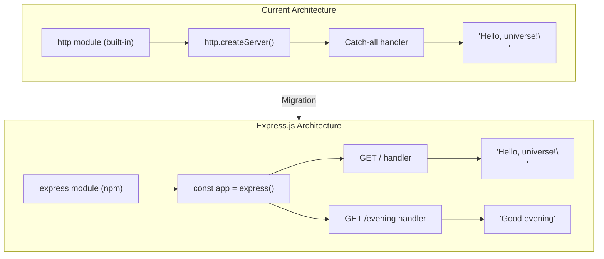

# Technical Specification

# 0. Agent Action Plan

## 0.1 Intent Clarification


### 0.1.1 Core Feature Objective

Based on the prompt, the Blitzy platform understands that the new feature requirement is to **migrate the existing bare Node.js HTTP server to Express.js and add a new route-specific endpoint**. Specifically:

- **Integrate Express.js framework**: Replace the current native `http` module server implementation in `server.js` with an Express.js application, introducing the Express framework as the project's first external dependency.
- **Add a new "Good evening" endpoint**: Create a dedicated HTTP route that returns the plain-text response `"Good evening"` when accessed by clients.
- **Preserve the existing "Hello world" behavior**: The user describes the existing server as returning `"Hello world"`. The current implementation in `server.js` (line 9) actually returns `"Hello, universe!\n"` for all requests. The platform interprets the user's intent as requiring the existing greeting response to remain accessible at a dedicated route so that current behavior is preserved.
- **Introduce route-based request handling**: The current server returns a single static response regardless of the request path or method. Adding Express.js enables proper URL-based routing, which is an implicit requirement for serving multiple distinct responses from different endpoints.

**Implicit Requirements Detected:**

- The project currently has zero external dependencies (confirmed in `package.json` and `package-lock.json`). Adding Express.js fundamentally changes the dependency model and requires updating both manifest files.
- The server must transition from a catch-all single-response handler to a multi-route architecture while keeping the same host (`127.0.0.1`) and port (`3000`).
- The CommonJS module system (`require()`) used in the current codebase must be maintained for consistency.

### 0.1.2 Special Instructions and Constraints

- **No special architectural directives** were provided by the user. The platform will follow the existing repository conventions (CommonJS, single-file server, localhost binding on port 3000).
- **Backward compatibility**: The existing greeting response (`"Hello, universe!\n"`) must remain accessible after the migration, ensuring that any consumers (backprop integration tests, CI/CD pipelines) that rely on the current endpoint continue to function.
- **No Figma URLs or UI attachments** were provided. This feature is purely a backend HTTP server modification.

User Example: *"add another endpoint that return the response of 'Good evening'"*

### 0.1.3 Technical Interpretation

These feature requirements translate to the following technical implementation strategy:

- To **integrate Express.js**, we will install `express` as a production dependency via npm, updating `package.json` (add `dependencies` field) and regenerating `package-lock.json` to reflect the new dependency tree.
- To **refactor the server**, we will modify `server.js` to replace the `http.createServer()` pattern with `express()` app initialization, converting the monolithic request handler into discrete route handlers.
- To **preserve the existing greeting**, we will create a `GET /` route in the Express app that returns the original `"Hello, universe!\n"` response with `Content-Type: text/plain` and HTTP 200 status, matching the current behavior.
- To **add the "Good evening" endpoint**, we will create a new `GET /evening` route in the Express app that returns `"Good evening"` with `Content-Type: text/plain` and HTTP 200 status.
- To **maintain operational parity**, we will keep the server bound to `127.0.0.1:3000` and preserve the startup console log message format.


## 0.2 Repository Scope Discovery


### 0.2.1 Comprehensive File Analysis

The repository is a minimal, flat-structure Node.js project consisting of exactly four files at the root level. Every file in the repository is affected by this feature addition.

**Complete Repository File Inventory:**

| File | Type | Current Purpose | Impact from Feature Addition |
|------|------|-----------------|------------------------------|
| `server.js` | Runtime source | HTTP server using native `http` module; responds with `"Hello, universe!\n"` to all requests on `127.0.0.1:3000` | **MODIFY** — Full rewrite to Express.js application with route-based handlers |
| `package.json` | Package manifest | Defines package `hello_world@1.0.0`; no dependencies; `main` points to `index.js`; only script is a placeholder `test` | **MODIFY** — Add `express` to `dependencies`; add `start` script; update `main` to `server.js` |
| `package-lock.json` | Lockfile | lockfileVersion 3 with empty dependency tree; confirms zero external packages | **REGENERATE** — Will be regenerated by npm to include Express.js and its transitive dependencies |
| `README.md` | Documentation | Contains project name `hao-backprop-test` and a warning: "Do not touch!" | **MODIFY** — Update documentation to reflect Express.js integration and new endpoint |

**Integration Point Discovery:**

| Integration Point | Current State | Required Change |
|-------------------|---------------|-----------------|
| HTTP server initialization | `http.createServer()` in `server.js` line 6 | Replace with `express()` app creation |
| Request handler | Anonymous callback handling all requests identically (lines 6–10) | Split into route-specific `app.get()` handlers |
| Server listener | `server.listen()` on `127.0.0.1:3000` (lines 12–14) | Replace with `app.listen()` on same host and port |
| Module imports | `const http = require('http')` (line 1) | Replace with `const express = require('express')` |
| Package metadata | `"main": "index.js"` in `package.json` (line 5) | Correct to `"main": "server.js"` to match actual entry point |

### 0.2.2 Web Search Research Conducted

- **Express.js latest stable version**: <cite index="3-2">The latest version is 5.2.1</cite>, confirmed on npm. <cite index="1-1">Express 5.1.0 is now the default on npm</cite>, and the 5.x line is the current active release.
- **Node.js compatibility**: <cite index="3-13">Node.js 18 or higher is required</cite> for Express 5.x. The project environment runs Node.js v20.20.0, which satisfies this requirement.
- **Express 5 routing**: <cite index="2-9">Updated to path-to-regexp@8.x, removing sub-expression regex patterns for security reasons</cite>. Standard string path routes (e.g., `'/'`, `'/evening'`) are fully supported and unaffected.
- **Express 5 promise support**: <cite index="2-10">Middleware can now return rejected promises, caught by the router as errors</cite>, improving error handling over Express 4.

### 0.2.3 New File Requirements

This feature addition operates primarily through modifications to existing files. Due to the minimal nature of the repository, no new source directories or complex file hierarchies are required.

**New source files to create:** None — all logic fits within the existing `server.js` file, consistent with the project's single-file architecture pattern.

**New test files to create:**

- `test/server.test.js` — Unit and integration tests for both the `GET /` and `GET /evening` endpoints to verify correct response bodies and status codes.

**New configuration:** None — Express.js configuration is handled inline within `server.js`, consistent with the project's minimalist approach.


## 0.3 Dependency Inventory


### 0.3.1 Private and Public Packages

The current project has zero external dependencies. This feature introduces Express.js as the project's first and only production dependency.

**Current Dependency State (from `package.json`):**

| Field | Status |
|-------|--------|
| `dependencies` | Not present |
| `devDependencies` | Not present |
| `peerDependencies` | Not present |

**Packages Required for Feature Addition:**

| Registry | Package Name | Version | Purpose |
|----------|-------------|---------|---------|
| npm (public) | `express` | `^5.2.1` | HTTP web framework — provides routing, middleware pipeline, and request/response abstractions to replace the native `http.createServer()` pattern |

**Version Justification:**

- Express `5.2.1` is the current latest stable release on the npm registry, verified via `npm view express@latest version`.
- The caret (`^5.2.1`) range allows compatible patch and minor updates within the 5.x major version line, following standard npm semver conventions.
- Node.js v20.20.0 (the project's runtime) exceeds the minimum requirement of Node.js 18 for Express 5.x.

**Transitive Dependency Note:** Express.js brings a tree of transitive dependencies (e.g., `body-parser`, `content-disposition`, `cookie`, `debug`, `finalhandler`, `path-to-regexp`, etc.). These will be fully captured in the regenerated `package-lock.json` and require no direct management.

### 0.3.2 Dependency Updates

**Import Updates:**

The sole source file `server.js` requires a complete import transformation:

| File | Current Import | New Import |
|------|---------------|------------|
| `server.js` | `const http = require('http')` | `const express = require('express')` |

The native `http` module import is fully replaced — Express.js internally uses `http` to create its server, so no direct reference to the built-in module is needed in application code.

**External Reference Updates:**

| File | Field/Section | Current Value | New Value |
|------|---------------|---------------|-----------|
| `package.json` | `dependencies` | *(not present)* | `{ "express": "^5.2.1" }` |
| `package.json` | `main` | `"index.js"` | `"server.js"` |
| `package.json` | `scripts.start` | *(not present)* | `"node server.js"` |
| `package-lock.json` | Full file | Empty dependency tree | Regenerated with Express.js dependency tree |
| `README.md` | Description | Current backprop test description | Updated to include Express.js setup and endpoint documentation |


## 0.4 Integration Analysis


### 0.4.1 Existing Code Touchpoints

The project's single-file architecture means all integration points converge within `server.js`. The following direct modifications are required:

**Direct Modifications Required:**

| File | Location | Current Code | Modification Required |
|------|----------|-------------|----------------------|
| `server.js` | Line 1 | `const http = require('http')` | Replace with `const express = require('express')` and add `const app = express()` |
| `server.js` | Lines 3–4 | `const hostname = '127.0.0.1'` and `const port = 3000` | Retain `port` constant; `hostname` is passed directly to `app.listen()` |
| `server.js` | Lines 6–10 | `http.createServer()` with catch-all handler returning `"Hello, universe!\n"` | Replace with `app.get('/', ...)` route handler returning the same response |
| `server.js` | *(new)* | *(does not exist)* | Add `app.get('/evening', ...)` route handler returning `"Good evening"` |
| `server.js` | Lines 12–14 | `server.listen(port, hostname, ...)` | Replace with `app.listen(port, hostname, ...)` preserving the startup log message |

**Dependency Injection Points:**

- Not applicable — the project does not use dependency injection containers or service registries. Express.js integrates directly via `require('express')` in `server.js`.

**Database/Schema Updates:**

- Not applicable — the project has no database or persistence layer. Both endpoints return static string responses.

### 0.4.2 Integration Flow Diagram



### 0.4.3 Behavioral Parity Mapping

To ensure existing consumers are not broken, the following behavioral characteristics must be preserved through the migration:

| Behavior | Current (`http` module) | Target (Express.js) | Preserved |
|----------|------------------------|---------------------|-----------|
| Listen address | `127.0.0.1:3000` | `127.0.0.1:3000` | Yes |
| `GET /` response body | `"Hello, universe!\n"` | `"Hello, universe!\n"` | Yes |
| `GET /` status code | `200` | `200` | Yes |
| `GET /` content type | `text/plain` | `text/plain` (via `res.type('text')`) | Yes |
| Startup console message | `Server running at http://127.0.0.1:3000/` | `Server running at http://127.0.0.1:3000/` | Yes |
| New `GET /evening` response | *(N/A)* | `"Good evening"` | New feature |


## 0.5 Technical Implementation


### 0.5.1 File-by-File Execution Plan

Every file listed below **MUST** be created or modified as specified. The files are grouped by their role in the implementation.

**Group 1 — Core Feature Files:**

| Action | File | Purpose |
|--------|------|---------|
| **MODIFY** | `server.js` | Rewrite to use Express.js; define `GET /` route returning `"Hello, universe!\n"` and `GET /evening` route returning `"Good evening"`; bind to `127.0.0.1:3000` |

**Group 2 — Package and Configuration:**

| Action | File | Purpose |
|--------|------|---------|
| **MODIFY** | `package.json` | Add `express@^5.2.1` to `dependencies`; add `start` script (`node server.js`); correct `main` field to `server.js` |
| **REGENERATE** | `package-lock.json` | Regenerated automatically by `npm install` to capture Express.js and all transitive dependencies in lockfileVersion 3 format |

**Group 3 — Tests and Documentation:**

| Action | File | Purpose |
|--------|------|---------|
| **CREATE** | `test/server.test.js` | Test coverage for both `GET /` and `GET /evening` endpoints verifying response status codes and bodies |
| **MODIFY** | `README.md` | Update project description to document Express.js integration, available endpoints, and startup instructions |

### 0.5.2 Implementation Approach per File

**`server.js` — Express.js Migration and New Endpoint**

The entire file is rewritten. The implementation replaces `http.createServer()` with Express.js routing:

```javascript
const express = require('express');
const app = express();
```

- Define `app.get('/', ...)` to return the original greeting `"Hello, universe!\n"` with `Content-Type: text/plain`, preserving backward compatibility for all existing consumers.
- Define `app.get('/evening', ...)` to return `"Good evening"` with `Content-Type: text/plain`, fulfilling the user's new endpoint requirement.
- Call `app.listen(3000, '127.0.0.1', ...)` to bind to the same loopback address and port as the original server, printing the same startup message to the console.

**`package.json` — Dependency Declaration**

Add the `dependencies` block and a `start` convenience script:

```json
"dependencies": { "express": "^5.2.1" },
"scripts": { "start": "node server.js", "test": "..." }
```

- The `main` field is corrected from `"index.js"` to `"server.js"` to accurately reflect the entry point.

**`package-lock.json` — Dependency Lock Regeneration**

This file is not manually edited. Running `npm install` after updating `package.json` regenerates it with the full Express.js dependency tree in lockfileVersion 3 format, ensuring deterministic installs.

**`test/server.test.js` — Endpoint Verification Tests**

- Test that `GET /` returns HTTP 200 with body `"Hello, universe!\n"`.
- Test that `GET /evening` returns HTTP 200 with body `"Good evening"`.
- Test that requests to undefined routes return appropriate responses (Express default 404).

**`README.md` — Documentation Update**

- Update project description to reflect Express.js integration.
- Document both available endpoints (`GET /` and `GET /evening`) with their expected responses.
- Add setup instructions: `npm install` followed by `npm start` or `node server.js`.

### 0.5.3 User Interface Design

Not applicable — this feature is a backend HTTP server modification with no user interface, no Figma screens, and no frontend components. All endpoints return plain-text responses accessible via any HTTP client.


## 0.6 Scope Boundaries


### 0.6.1 Exhaustively In Scope

All files and patterns that are within the scope of this feature addition:

**Source Files:**

| Pattern | Files Matched | Scope Reason |
|---------|---------------|--------------|
| `server.js` | `server.js` | Core server rewrite from `http` module to Express.js with route definitions |

**Package and Configuration Files:**

| Pattern | Files Matched | Scope Reason |
|---------|---------------|--------------|
| `package.json` | `package.json` | Add `express` dependency, `start` script, and correct `main` field |
| `package-lock.json` | `package-lock.json` | Regenerated by npm to capture Express.js dependency tree |

**Test Files:**

| Pattern | Files Matched | Scope Reason |
|---------|---------------|--------------|
| `test/**/*.js` | `test/server.test.js` | New test file validating both endpoint responses |

**Documentation:**

| Pattern | Files Matched | Scope Reason |
|---------|---------------|--------------|
| `README.md` | `README.md` | Update project description, endpoint docs, and setup instructions |

**Complete In-Scope File List:**

| # | File | Action | Status |
|---|------|--------|--------|
| 1 | `server.js` | MODIFY | Rewrite to Express.js |
| 2 | `package.json` | MODIFY | Add dependency and scripts |
| 3 | `package-lock.json` | REGENERATE | npm install output |
| 4 | `test/server.test.js` | CREATE | Endpoint tests |
| 5 | `README.md` | MODIFY | Documentation update |

### 0.6.2 Explicitly Out of Scope

The following items are explicitly **not** part of this feature addition:

- **HTTPS/TLS support** — The server remains HTTP-only on localhost, consistent with its test fixture purpose
- **Additional middleware** — No body parsing, CORS, logging middleware, or authentication layers are required for static text responses
- **Database or persistence** — Both endpoints return hardcoded strings; no data storage is needed
- **Docker or CI/CD pipeline changes** — No `Dockerfile`, `docker-compose.yml`, or `.github/workflows/` files exist in the repository and none are required
- **Environment variable configuration** — Host and port remain hardcoded as `127.0.0.1` and `3000`
- **ES module migration** — The project stays on CommonJS (`require()`); no conversion to `import/export` syntax
- **Performance optimization** — No caching, clustering, or load balancing beyond Express.js defaults
- **Refactoring unrelated to Express.js integration** — No changes to project structure, naming conventions, or architecture beyond what is necessary for the feature
- **Additional endpoints beyond `/evening`** — Only the single new endpoint requested by the user is in scope


## 0.7 Rules for Feature Addition


### 0.7.1 Feature-Specific Rules and Requirements

The user did not specify explicit rules or constraints beyond the core request. The following rules are derived from the repository's established conventions and the implicit requirements of the feature:

**Convention Preservation Rules:**

- **CommonJS module system**: All imports must use `require()` syntax, consistent with the existing `server.js` implementation. Do not introduce ES module `import` syntax.
- **Single-file server pattern**: The Express.js application and all route definitions must reside within `server.js`, maintaining the project's monolithic single-file architecture.
- **Localhost binding**: The server must remain bound to `127.0.0.1` (not `0.0.0.0` or any wildcard address) to preserve the security-through-isolation principle.
- **Port 3000**: The listening port must remain `3000` to avoid breaking any existing consumers or test fixtures.

**Response Format Rules:**

- The `GET /` endpoint must return the exact string `"Hello, universe!\n"` with `Content-Type: text/plain` and HTTP status `200`, maintaining byte-for-byte compatibility with the current server behavior.
- The `GET /evening` endpoint must return the exact string `"Good evening"` as specified by the user, with `Content-Type: text/plain` and HTTP status `200`.

**Dependency Management Rules:**

- Use the caret version range (`^5.2.1`) for Express.js in `package.json` to allow compatible updates within the 5.x line.
- The `package-lock.json` must be regenerated (not manually edited) to ensure integrity and correctness of the dependency tree.
- No additional dependencies beyond `express` should be introduced unless strictly required by Express 5.x itself (transitive dependencies are acceptable).

**Startup Behavior Rules:**

- The server must print a startup message to the console upon successful binding, matching or closely following the original format: `Server running at http://127.0.0.1:3000/`.


## 0.8 References


### 0.8.1 Repository Files and Folders Searched

The following files and folders were retrieved and analyzed to derive the conclusions in this Agent Action Plan:

| # | Path | Type | Tool Used | Key Finding |
|---|------|------|-----------|-------------|
| 1 | `` (root) | Folder | `get_source_folder_contents` | Flat repository with 4 files; no subdirectories; minimal Node.js project |
| 2 | `server.js` | File | `read_file` | 15-line HTTP server using `http.createServer()`; returns `"Hello, universe!\n"` on all requests at `127.0.0.1:3000` |
| 3 | `package.json` | File | `read_file` | Package `hello_world@1.0.0`; MIT license; author `hxu`; no dependencies; `main` set to `index.js`; placeholder test script |
| 4 | `package-lock.json` | File | `read_file` | lockfileVersion 3; empty dependency tree; confirms zero external packages |
| 5 | `README.md` | File | `read_file` | Project name `hao-backprop-test`; contains "Do not touch!" policy notice |

### 0.8.2 Technical Specification Sections Referenced

| Section | Key Information Extracted |
|---------|--------------------------|
| 1.1 Executive Summary | Project purpose as a backprop integration test fixture; stakeholder identification |
| 2.1 Feature Catalog | Single feature F-001 (HTTP Test Fixture Service); zero-dependency design |
| 3.2 Programming Languages | JavaScript with CommonJS module system; no Node.js version constraint specified |
| 3.4 Open Source Dependencies | Zero external dependencies confirmed; lockfileVersion 3 format |
| 5.1 High-Level Architecture | Monolithic single-file architecture; deterministic behavior and immutability principles |

### 0.8.3 External Research Conducted

| # | Search Query | Source | Key Finding |
|---|-------------|--------|-------------|
| 1 | Express.js latest stable version | npmjs.com/package/express | Latest version is `5.2.1`; requires Node.js 18+ |
| 2 | Express.js latest stable version | expressjs.com (release blog) | Express 5.1.0 tagged as `latest` on npm with official LTS timeline |
| 3 | Express.js latest stable version | github.com/expressjs/express | Express 5 drops Node.js versions before v18; improved async error handling |

### 0.8.4 Attachments and Figma Screens

No attachments were provided for this project. No Figma URLs or UI design screens were specified in the user's instructions.


