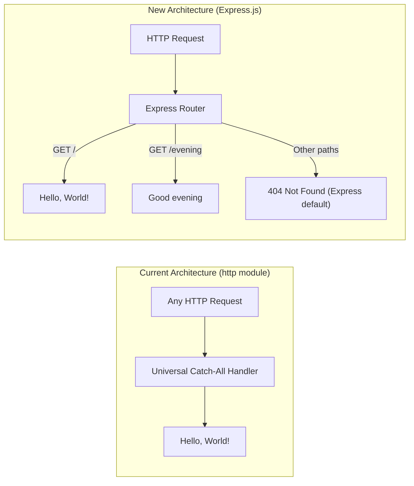

# Technical Specification

# 0. Agent Action Plan

## 0.1 Intent Clarification

### 0.1.1 Core Feature Objective

Based on the prompt, the Blitzy platform understands that the new feature requirement is to **introduce the Express.js framework into an existing minimal Node.js HTTP server and add a new HTTP endpoint** that returns a "Good evening" response. Specifically:

- **Integrate Express.js as a dependency**: The project currently uses the Node.js built-in `http` module (`server.js`, line 1: `const http = require('http')`) with zero external dependencies. The user requests migrating the HTTP server layer to Express.js, which will become the project's first and only external dependency.
- **Preserve the existing "Hello, World!" endpoint**: The current server responds with `Hello, World!\n` (plain text, HTTP 200) on all requests regardless of path or method. This response must be retained as a dedicated route within the Express.js application.
- **Add a new "Good evening" endpoint**: A new route must be created that returns the response `Good evening` to the client, distinct from the existing hello-world response.

**Implicit requirements detected:**

- The existing server's universal catch-all handler (which responds identically to every request) must be decomposed into explicit, path-based route definitions under Express.js.
- Since the user describes the project as "a tutorial," the implementation should remain simple, readable, and follow Express.js conventions for educational clarity.
- The server binding configuration (`127.0.0.1:3000`) and the startup console notification should be preserved to maintain operational parity with the current implementation.
- The `package.json` manifest must be updated to register `express` as a production dependency, and `package-lock.json` will be regenerated to reflect the new dependency tree.

### 0.1.2 Special Instructions and Constraints

- **No specific integration directives** were provided beyond adding Express.js and the new endpoint.
- **Architectural alignment**: The existing CommonJS module system (`require()` syntax) must be maintained for consistency. The project does not use ES Modules (`import` syntax), as confirmed by the absence of `"type": "module"` in `package.json`.
- **Tutorial simplicity**: The user explicitly described this as a tutorial project. Implementations should favor simplicity and readability over enterprise patterns (e.g., no need for a dedicated router module, middleware chains, or separate controller layers).
- **No user-provided examples or special directives** to preserve.

### 0.1.3 Technical Interpretation

These feature requirements translate to the following technical implementation strategy:

- To **integrate Express.js**, we will install `express@5.2.1` as a production dependency via npm, updating `package.json` (adding a `dependencies` block) and regenerating `package-lock.json`.
- To **preserve the "Hello, World!" endpoint**, we will create an Express route handler (e.g., `app.get('/', ...)`) in `server.js` that returns the same `Hello, World!\n` plain-text response with HTTP 200 status and `Content-Type: text/plain` header.
- To **add the "Good evening" endpoint**, we will create a second Express route handler (e.g., `app.get('/evening', ...)`) in `server.js` that returns `Good evening` as a plain-text response.
- To **migrate the server bootstrap**, we will replace the raw `http.createServer()` and `server.listen()` calls with Express's `app.listen()`, preserving the same host (`127.0.0.1`) and port (`3000`) configuration, along with the startup console log message.
- To **update project metadata**, we will correct the `"main"` field in `package.json` from `"index.js"` (which does not exist) to `"server.js"` to accurately reflect the actual entry point, and update the `description` to reflect the expanded functionality.

## 0.2 Repository Scope Discovery

### 0.2.1 Comprehensive File Analysis

The repository has a completely flat structure with exactly four files at the root level and no sub-directories (aside from `.git/`). Every file in the repository is affected by this feature addition.

**Existing Files Requiring Modification:**

| File | Current Size | Current Role | Required Modifications |
|------|-------------|--------------|----------------------|
| `server.js` | 342 bytes, 14 lines | Sole runtime artifact; creates HTTP server using built-in `http` module with a universal catch-all handler returning `Hello, World!\n` | **Complete rewrite** — Replace `http.createServer()` with Express.js app; define explicit route handlers for `/` (Hello World) and `/evening` (Good Evening); retain host/port configuration and startup log |
| `package.json` | 251 bytes | npm manifest; declares package identity (`hello_world@1.0.0`), author (`hxu`), license (MIT); contains no dependencies | **Modify** — Add `dependencies: { "express": "^5.2.1" }`; update `"main"` field from `"index.js"` to `"server.js"`; update `"description"` to reflect Express.js usage; add a `"start"` script |
| `package-lock.json` | 247 bytes | Dependency lock file (`lockfileVersion: 3`); currently confirms zero external dependencies | **Auto-regenerated** — Will be completely replaced by npm upon `npm install express` to include the full Express.js dependency tree |
| `README.md` | 73 bytes | Project identity (`hao-backprop-test`) and immutability directive | **Modify** — Update documentation to describe the Express.js-powered server with two endpoints and usage instructions appropriate for a tutorial |

**Integration Point Discovery:**

- **API Endpoints**: The current server has no route differentiation — all requests (any method, any path) receive the same response. Express.js introduces explicit routing, requiring decomposition into discrete endpoint definitions.
- **Server Bootstrap**: The server initialization in `server.js` (lines 6–14) uses `http.createServer()` and `server.listen()`. This must be replaced with Express's `express()` factory and `app.listen()`.
- **Module Imports**: Line 1 (`const http = require('http')`) must be replaced with `const express = require('express')`.
- **No database, middleware, service, or controller layers exist** — the project is too minimal to have any of these components.

### 0.2.2 Web Search Research Conducted

- **Express.js latest stable version**: Confirmed as `5.2.1` via the npm registry. Express 5.x is now the default `latest` tag on npm as of the Express 5.1.0 release.
- **Express 5.x Node.js compatibility**: Requires Node.js >= 18. The project's Node.js v20.20.0 runtime satisfies this requirement.
- **Express 5.x key changes from v4**: Native async/await support in middleware, updated `path-to-regexp` for route matching, removed deprecated v3/v4 API methods, built-in promise rejection handling.
- **Express.js basic routing patterns**: Route handlers follow the pattern `app.METHOD(path, handler)` where handler receives `(req, res)` parameters. The `res.send()` method auto-sets `Content-Type` based on response body type.

### 0.2.3 New File Requirements

No new source files need to be created. The feature addition is scoped entirely to modifications of existing files. The project's tutorial nature and minimal footprint mean all logic remains within `server.js`, and all metadata remains in the existing manifest files.

**New files auto-generated by tooling:**

- `node_modules/` — Created by `npm install` to house the Express.js package and its transitive dependencies. This directory is managed entirely by npm and should not be committed to version control.
- `node_modules/express/` — The Express.js framework package and its dependency tree.

## 0.3 Dependency Inventory

### 0.3.1 Private and Public Packages

The project currently has **zero dependencies**. This feature addition introduces Express.js as the sole direct dependency, bringing 65 total packages (1 direct + 64 transitive) into the project.

**Direct Dependency:**

| Registry | Package Name | Version | Purpose |
|----------|-------------|---------|---------|
| npm (public) | `express` | `5.2.1` | Web application framework; provides HTTP routing, request/response handling, and middleware architecture to replace the raw `http` module server |

**Key Transitive Dependencies (auto-installed with Express):**

| Registry | Package Name | Version | Purpose |
|----------|-------------|---------|---------|
| npm (public) | `body-parser` | `2.2.2` | Request body parsing middleware (bundled with Express 5.x) |
| npm (public) | `path-to-regexp` | `8.3.0` | Route pattern matching engine for Express routing |
| npm (public) | `accepts` | `2.0.0` | Content negotiation for HTTP request Accept headers |
| npm (public) | `content-type` | `1.0.5` | MIME Content-Type header parsing and formatting |
| npm (public) | `cookie` | `0.7.2` | HTTP cookie parsing and serialization |
| npm (public) | `debug` | `4.4.3` | Debugging utility used internally by Express |
| npm (public) | `finalhandler` | `2.1.1` | Final request handler for unmatched routes |
| npm (public) | `http-errors` | `2.0.1` | HTTP error creation utilities |
| npm (public) | `etag` | `1.8.1` | ETag generation for HTTP caching |
| npm (public) | `send` | `1.2.1` | Static file streaming for `res.sendFile()` |

The total installation adds **65 packages** to the `node_modules/` directory.

### 0.3.2 Dependency Updates

**Import Updates:**

The only file requiring import changes is `server.js`:

| File | Current Import | New Import |
|------|---------------|------------|
| `server.js` | `const http = require('http');` | `const express = require('express');` |

The `http` module import is fully removed — Express.js internally manages its own HTTP server creation. No other files in the repository contain import statements.

**External Reference Updates:**

| File | Change Required |
|------|----------------|
| `package.json` | Add `"dependencies": { "express": "^5.2.1" }` block; update `"description"` and `"main"` fields; add `"start"` script |
| `package-lock.json` | Auto-regenerated by npm to include full Express dependency tree with `lockfileVersion: 3` |
| `README.md` | Update documentation to reference Express.js dependency and `npm install` requirement |

## 0.4 Integration Analysis

### 0.4.1 Existing Code Touchpoints

The repository consists of only four files, all of which are directly impacted by this feature addition. The integration points are concentrated in `server.js`, which is the sole runtime artifact.

**Direct modifications required:**

- **`server.js` (lines 1–14, complete file)**: Replace the entire HTTP server implementation. The current file uses `http.createServer()` with a universal catch-all handler. This must be replaced with an Express application instance that defines two explicit route handlers:
  - Line 1: Replace `const http = require('http')` with `const express = require('express')`
  - Lines 3–4: Retain `hostname` and `port` constants (`127.0.0.1`, `3000`)
  - Lines 6–10: Replace the `http.createServer((req, res) => {...})` block with Express app initialization (`const app = express()`) and two route definitions:
    - `app.get('/')` — returns `Hello, World!\n`
    - `app.get('/evening')` — returns `Good evening`
  - Lines 12–14: Replace `server.listen()` with `app.listen()`, preserving the port, hostname, and callback log message

- **`package.json` (4 fields affected)**:
  - `"main"` field (line 5): Change from `"index.js"` to `"server.js"`
  - `"description"` field (line 4): Update to reflect Express.js and dual-endpoint functionality
  - `"scripts"` block (lines 6–8): Add `"start": "node server.js"` for standard npm start workflow
  - New `"dependencies"` block: Add `"express": "^5.2.1"`

- **`package-lock.json` (entire file)**: Regenerated automatically by npm upon dependency installation. The file will grow from 247 bytes (root-only) to include the full Express.js dependency graph with 65 packages.

- **`README.md` (entire file)**: Update documentation to describe the Express.js-based server, list the two endpoints, and provide setup/run instructions.

**Dependency injections:** Not applicable — the project has no dependency injection container, service registry, or IoC framework.

**Database/Schema updates:** Not applicable — the project has no database, ORM, or data persistence layer.

### 0.4.2 Integration Flow

The following diagram illustrates how the Express.js integration changes the request handling flow compared to the current architecture:



**Key behavioral change**: The current server responds identically to every request regardless of path. After migration to Express.js, only explicitly defined routes will return successful responses. Unmatched routes will receive Express's default 404 response via `finalhandler`. This is an intentional improvement that aligns with standard HTTP semantics and RESTful design principles.

## 0.5 Technical Implementation

### 0.5.1 File-by-File Execution Plan

Every file listed below MUST be modified as part of this feature addition. There are no new files to create — the entire change set applies to the four existing repository files.

**Group 1 — Core Runtime (server.js):**

- **MODIFY: `server.js`** — Complete rewrite of the HTTP server implementation
  - Remove the `http` module import and replace with `express`
  - Initialize an Express application instance via `const app = express()`
  - Define `GET /` route returning `Hello, World!\n` with `Content-Type: text/plain`
  - Define `GET /evening` route returning `Good evening` with `Content-Type: text/plain`
  - Replace `server.listen()` with `app.listen()`, preserving the `127.0.0.1:3000` binding and the startup console log message

**Group 2 — Package Manifest (package.json):**

- **MODIFY: `package.json`** — Update project metadata and add Express.js dependency
  - Update `"description"` to reflect the dual-endpoint Express.js server
  - Change `"main"` from `"index.js"` to `"server.js"` (fixes a pre-existing discrepancy)
  - Add `"start": "node server.js"` to the `"scripts"` block
  - Add `"dependencies": { "express": "^5.2.1" }`

**Group 3 — Dependency Lock (package-lock.json):**

- **MODIFY: `package-lock.json`** — Auto-regenerated by npm
  - Running `npm install` after updating `package.json` will regenerate this file to include all 65 packages in the Express.js dependency tree

**Group 4 — Documentation (README.md):**

- **MODIFY: `README.md`** — Update tutorial documentation
  - Add project description covering Express.js integration
  - Document available endpoints (`GET /` and `GET /evening`) with expected responses
  - Add setup instructions (`npm install`) and run instructions (`npm start` or `node server.js`)

### 0.5.2 Implementation Approach per File

**`server.js` — Express.js Migration:**

The server file will be restructured as follows. The Express application replaces the raw `http.createServer()` pattern while preserving the same host, port, and startup behavior:

```js
const express = require('express');
const app = express();
```

Two route handlers will be registered:
- `app.get('/', ...)` sends `Hello, World!\n` as plain text
- `app.get('/evening', ...)` sends `Good evening` as plain text

The server starts with:

```js
app.listen(port, hostname, () => { ... });
```

This preserves the existing binding to `127.0.0.1:3000` and the console startup notification, ensuring operational parity with the current implementation.

**`package.json` — Dependency Declaration:**

The manifest file gains a `dependencies` block and corrected metadata fields. The `express` package is pinned with a caret range (`^5.2.1`) to allow patch-level updates within the 5.x major version, following npm's recommended semver strategy.

**`package-lock.json` — Automatic Regeneration:**

This file is fully managed by npm. After the `package.json` is updated and `npm install` is executed, npm will resolve the entire Express.js dependency tree and write a new lock file with `lockfileVersion: 3`, ensuring deterministic installs across all environments.

**`README.md` — Tutorial Documentation:**

The documentation will be rewritten to reflect the updated project structure:
- Project title and purpose description
- Prerequisites (Node.js v20+, npm v9+)
- Installation steps (`npm install`)
- How to run the server (`npm start`)
- Endpoint reference table listing both routes

### 0.5.3 User Interface Design

Not applicable — this project is a backend-only HTTP server with no frontend, UI components, or Figma screens. All endpoints return plain-text responses.

## 0.6 Scope Boundaries

### 0.6.1 Exhaustively In Scope

**All source files (entire repository):**

| File Pattern | Specific File(s) | Scope of Change |
|-------------|-------------------|-----------------|
| `server.js` | `server.js` | Complete rewrite — replace `http` module with Express.js, define two route handlers (`GET /` and `GET /evening`), preserve host/port/startup log |
| `package.json` | `package.json` | Add `express@^5.2.1` dependency, update `main`, `description`, and `scripts` fields |
| `package-lock.json` | `package-lock.json` | Full regeneration via `npm install` to include Express.js dependency tree (65 packages) |
| `README.md` | `README.md` | Rewrite documentation with setup instructions, endpoint reference, and usage guide |

**Route definitions:**

| Route | Method | Response Body | Content-Type | HTTP Status |
|-------|--------|--------------|--------------|-------------|
| `/` | GET | `Hello, World!\n` | `text/plain` | 200 |
| `/evening` | GET | `Good evening` | `text/plain` | 200 |

**Configuration preserved:**

| Setting | Value | Location |
|---------|-------|----------|
| Hostname | `127.0.0.1` | `server.js` |
| Port | `3000` | `server.js` |
| Startup log | `Server running at http://127.0.0.1:3000/` | `server.js` |
| Module system | CommonJS (`require()`) | `server.js` |
| License | MIT | `package.json` |
| Package name | `hello_world` | `package.json` |
| Package version | `1.0.0` | `package.json` |

### 0.6.2 Explicitly Out of Scope

- **Express middleware configuration** — No custom middleware (logging, CORS, authentication, rate limiting, etc.) is required. The tutorial nature of the project does not call for middleware beyond Express's built-in defaults.
- **Environment variable configuration** — Host and port remain hardcoded constants. No `.env` file, `dotenv` package, or environment-based configuration switching is needed.
- **Error handling middleware** — Express 5.x provides adequate default error handling via `finalhandler`. Custom error handlers are not required for a two-route tutorial.
- **Testing infrastructure** — No test framework, test files, or test scripts are being added. The `scripts.test` placeholder remains as-is.
- **CI/CD pipeline** — No GitHub Actions workflows, deployment scripts, or containerization files (Dockerfile, docker-compose) are being introduced.
- **TypeScript migration** — The project remains in plain JavaScript with CommonJS module syntax.
- **Database or data persistence** — No database, ORM, or storage layer is being introduced.
- **Additional endpoints beyond the two specified** — Only `GET /` and `GET /evening` are in scope. No health check, API versioning, or catch-all fallback endpoints are added.
- **Frontend or static file serving** — No `express.static()` middleware or HTML/CSS/JS assets.
- **Performance optimization** — No clustering, caching, compression, or load balancing.

## 0.7 Rules for Feature Addition

### 0.7.1 Feature-Specific Rules

The following rules govern the Express.js integration and endpoint addition:

- **Preserve existing behavior**: The `GET /` endpoint must return the exact same response body (`Hello, World!\n`) and content type (`text/plain`) as the current universal handler to maintain backward compatibility for any consumers of this endpoint.
- **Maintain CommonJS syntax**: All imports must use `require()` (CommonJS). Do not introduce ES Module `import` syntax or add `"type": "module"` to `package.json`.
- **Use Express 5.x conventions**: Since Express 5.2.1 is being installed, use Express 5.x-compatible API patterns. This includes leveraging native async error handling and the updated routing engine.
- **Keep the flat file structure**: Do not introduce sub-directories, route modules, or controller files. All application logic remains in `server.js` as appropriate for a tutorial project.
- **Retain server binding configuration**: The server must continue to bind to `127.0.0.1` on port `3000` and emit the same startup log message to stdout.
- **Use `res.send()` for responses**: Express's `res.send()` method should be used for response delivery. For plain-text responses, explicitly set the Content-Type header using `res.type('text')` or `res.set('Content-Type', 'text/plain')` to maintain consistency with the current `text/plain` response type.
- **Semantic version range for Express**: Use caret notation (`^5.2.1`) in `package.json` to allow compatible patch and minor updates within the Express 5.x line, following npm best practices.
- **No `node_modules` in version control**: The generated `node_modules/` directory must not be committed. A `.gitignore` file should be considered to prevent accidental inclusion.

## 0.8 References

### 0.8.1 Repository Files and Folders Searched

The following files and folders were inspected to derive the conclusions in this Agent Action Plan:

| Path | Type | Key Findings |
|------|------|-------------|
| `` (root) | Folder | Flat structure with 4 files; no sub-directories; confirmed as minimal Node.js tutorial project |
| `server.js` | File | 14-line HTTP server using `http.createServer()`; binds to `127.0.0.1:3000`; universal catch-all handler returning `Hello, World!\n` |
| `package.json` | File | Package `hello_world@1.0.0`; author `hxu`; MIT license; `main` incorrectly set to `index.js`; zero dependencies; stub test script |
| `package-lock.json` | File | `lockfileVersion: 3` (npm 9+); single root-only package entry; confirms zero external dependencies |
| `README.md` | File | Project identity `hao-backprop-test`; immutability directive "Do not touch!" |

### 0.8.2 Technical Specification Sections Referenced

| Section | Key Information Derived |
|---------|------------------------|
| 1.1 Executive Summary | Project purpose as backprop integration test fixture; four-file repository structure |
| 2.1 Feature Catalog | Feature definitions F-001 through F-004; current zero-dependency architecture |
| 3.2 Programming Languages | JavaScript (CommonJS) as sole language; ES6+ compatible; no transpilation |
| 3.4 Open Source Dependencies | Confirmed zero-dependency baseline; npm registry configuration |
| Node.js Runtime Justification (§3.7) | Node.js v20.20.0 runtime; npm v11.1.0; lockfileVersion 3; no build system |
| 5.2 Component Details | Detailed component architecture; server lifecycle; universal catch-all handler behavior |

### 0.8.3 External Research Sources

| Source | Information Retrieved |
|--------|----------------------|
| npm registry (`npmjs.com/package/express`) | Express.js latest version confirmed as `5.2.1`; Node.js engine requirement `>= 18` |
| Express.js GitHub Releases (`github.com/expressjs/express/releases`) | Express 5.x release details; dropped Node.js < 18 support; updated `path-to-regexp@8.x` |
| Express.js Official Blog (`expressjs.com`) | Express 5.1.0 is now `latest` on npm; LTS schedule for v4 and v5 release lines |

### 0.8.4 Attachments

No attachments were provided for this project. No Figma screens, design documents, or supplementary files were included.

